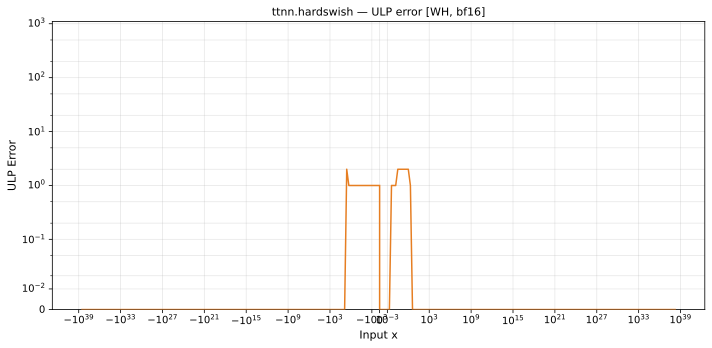

# hardswish — Wormhole (WH), bfloat16
_This page is auto-generated by `ttnn-accuracy report`. Do not edit manually._

**Architecture:** Wormhole (WH)  
**Data type:** bfloat16  

---

[← Wormhole (WH) bfloat16 ops](README.md) | [All archs for hardswish](../../../by_op/hardswish/README.md) | [Top](../../../README.md)

**Measured input range:** x ∈ [-3.39e+38, 3.39e+38]  

|  | `default` |
|---|---|
| Max ULP | 2.14 |
| Min ULP | 0 |
| Mean ULP | 0.94 |
| Signed bias (ULP) | -0.293 |
| p50 ULP | 0 |
| p95 ULP | 0.5 |
| p99 ULP | 1 |
| Exact fraction | 0.95 |
| Correctly rounded | 0.95 |
| Accurate to \|x\| | 2.33e-38 |
| Max abs error | 0.0163 |
| Max rel error | 0.00944 |
| Median rel error | 0.00473 |
| Bits of precision (worst) | 6.73 |
| Bits of precision (median) | 7.72 |

**default** — 2 of 65024 points returned inf or zero where a value exists; the rest reach 2.14 ULP  

**Outcomes**

| Parameters | exact | faithful | flushed | inexact | zeroed |
|---|---|---|---|---|---|
| `default` | 61,512 | 2,029 | 254 | 1,227 | 2 |

**Worst points**

| Parameters | x | golden | device | ULP |
|---|---|---|---|---|
| `default` | 0.115722656 | 0.060058594 | 0.059570312 | 2.14 |
| `default` | 0.115234375 | 0.059814453 | 0.059326172 | 2.07 |
| `default` | 0.20996094 | 0.11230469 | 0.111328125 | 2.05 |
| `default` | 0.114746094 | 0.059570312 | 0.05908203 | 1.99 |
| `default` | 0.67578125 | 0.4140625 | 0.41015625 | 1.97 |
| `default` | -2.453125 | -0.22363281 | -0.22167969 | 1.96 |
| `default` | 0.11425781 | 0.059326172 | 0.05883789 | 1.91 |
| `default` | 0.20898438 | 0.111816406 | 0.110839844 | 1.91 |
| `default` | 0.18652344 | 0.099121094 | 0.09814453 | 1.88 |
| `default` | 0.34960938 | 0.1953125 | 0.19335938 | 1.86 |

**Monotonicity**

_Checked only where the reference is itself ordered, and never across a discontinuity._

| Parameters | Pairs | Violations | Rate | Worst \|Δy\| |
|---|---|---|---|---|
| `default` | 32,383 | 0 | 0 | 0 |

### Special values

| Variant | x | device | golden |  |
|---|---|---|---|---|
| `default` | 0 | 0 | 0 | agree |
| `default` | -0 | 0 | -0 | **differ** |
| `default` | inf | inf | inf | agree |
| `default` | -inf | 0 | nan | **differ** |
| `default` | nan | inf | nan | **differ** |
| `default` | 1.1754944e-38 | 0 | 5.877472e-39 | **differ** |
| `default` | -1.1754944e-38 | 0 | -5.877472e-39 | **differ** |

> **Provenance unknown.** These figures predate run tracking. Re-measure to attribute them.

