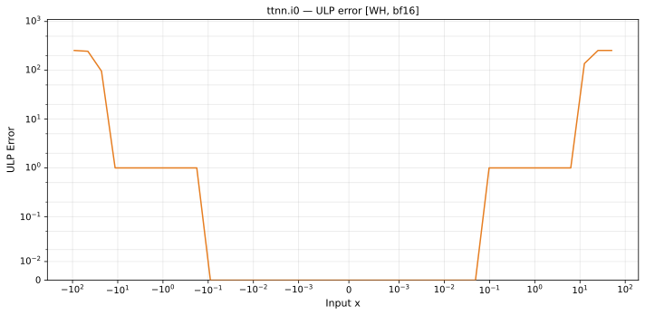

# i0 — Wormhole (WH), bfloat16
_This page is auto-generated by `ttnn-accuracy report`. Do not edit manually._

_Generated: 2026-08-31 10:49_

**Architecture:** Wormhole (WH)  
**Data type:** bfloat16  

---

[← Wormhole (WH) bfloat16 ops](README.md) | [All archs for i0](../../../by_op/i0/README.md) | [Top](../../../README.md)

**Measured input range:** x ∈ [-91.5, 91.5]  

| Parameters | Max ULP | Mean ULP | Accurate to \|x\| | Max abs error |
|---|---|---|---|---------------|
| `default` | 255 | 56.4 | 13.9 | 2.29e+38 |

**default** — accurate to |x| <= 13.9; up to 255 ULP beyond  

**Outcomes**

| Parameters | exact | inexact |
|------------|------|------|
| `default` | 32,260 | 1,644 |

### Special values

| Variant | x | device | golden | |
|---|---|---|---|---|
| `default` | 0 | 1 | 1 | agree |
| `default` | -0 | 1 | 1 | agree |
| `default` | inf | inf | nan | **differ** |
| `default` | -inf | inf | nan | **differ** |
| `default` | nan | inf | nan | **differ** |
| `default` | 1.175e-38 | 1 | 1 | agree |
| `default` | -1.175e-38 | 1 | 1 | agree |

_Measured on WORMHOLE_B0 · tt-metal `2adf8c65887` · ttnn `0.75.0rc10.dev817+g2adf8c65887` · run `20260831T073412`_

