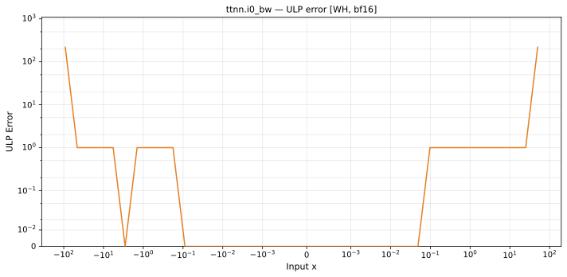

# i0_bw — Wormhole (WH), bfloat16
_This page is auto-generated by `ttnn-accuracy report`. Do not edit manually._

**Architecture:** Wormhole (WH)  
**Data type:** bfloat16  

---

[← Wormhole (WH) bfloat16 ops](README.md) | [All archs for i0_bw](../../../by_op/i0_bw/README.md) | [Top](../../../README.md)

**Measured input range:** x ∈ [-91.5, 91.5]  

|  | `default` |
|---|---|
| Max ULP | 218 |
| Min ULP | 0 |
| Mean ULP | 8.58 |
| Signed bias (ULP) | 0 |
| p50 ULP | 0 |
| p95 ULP | 0.191 |
| p99 ULP | 0.47 |
| Exact fraction | 0.993 |
| Correctly rounded | 0.993 |
| Accurate to \|x\| | 2.33e-38 |
| Max abs error | 2.16e+38 |
| Max rel error | 0.949 |
| Median rel error | 0.00325 |
| Bits of precision (worst) | 0.0753 |
| Bits of precision (median) | 8.26 |

**default** — 4 of 33904 points returned inf or zero where a value exists  

**Outcomes**

| Parameters | exact | faithful | flushed | inexact | zeroed |
|---|---|---|---|---|---|
| `default` | 33,422 | 212 | 254 | 12 | 4 |

**Worst points**

| Parameters | x | golden | device | ULP |
|---|---|---|---|---|
| `default` | 90.5 | 8.407367e+37 | 1.1547668e+37 | 218 |
| `default` | -90.5 | -8.407367e+37 | -1.1547668e+37 | 218 |
| `default` | 91 | 1.3823971e+38 | 1.1547668e+37 | 191 |
| `default` | -91 | -1.3823971e+38 | -1.1547668e+37 | 191 |
| `default` | 91.5 | 2.2729799e+38 | 1.1547668e+37 | 162 |
| `default` | -91.5 | -2.2729799e+38 | -1.1547668e+37 | 162 |
| `default` | 90 | 5.117528e+37 | 1.1547668e+37 | 119 |
| `default` | -90 | -5.117528e+37 | -1.1547668e+37 | 119 |
| `default` | 89.5 | 3.1070704e+37 | 1.1547668e+37 | 118 |
| `default` | -89.5 | -3.1070704e+37 | -1.1547668e+37 | 118 |

**Monotonicity**

_Checked only where the reference is itself ordered, and never across a discontinuity._

| Parameters | Pairs | Violations | Rate | Worst \|Δy\| |
|---|---|---|---|---|
| `default` | 33,644 | 0 | 0 | 0 |

### Special values

| Variant | x | device | golden |  |
|---|---|---|---|---|
| `default` | 0 | 0 | 0 | agree |
| `default` | -0 | 0 | 0 | agree |
| `default` | inf | 1.1547668e+37 | nan | **differ** |
| `default` | -inf | -1.1547668e+37 | nan | **differ** |
| `default` | nan | 1.1547668e+37 | nan | **differ** |
| `default` | 1.1754944e-38 | 0 | 5.877472e-39 | **differ** |
| `default` | -1.1754944e-38 | 0 | -5.877472e-39 | **differ** |

_Measured on WORMHOLE_B0 · tt-metal `a3a9fb4229a` · ttnn `0.78.0` · run `20260917T224646`_

