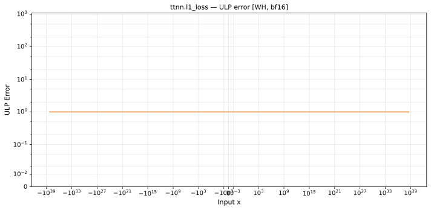

# l1_loss — Wormhole (WH), bfloat16
_This page is auto-generated by `ttnn-accuracy report`. Do not edit manually._

**Architecture:** Wormhole (WH)  
**Data type:** bfloat16  

---

[← Wormhole (WH) bfloat16 ops](README.md) | [All archs for l1_loss](../../../by_op/l1_loss/README.md) | [Top](../../../README.md)

**Measured input range:** all normal values  

|  | `default` |
|---|---|
| Max ULP | 0.621 |
| Min ULP | 0.5 |
| Mean ULP | 0.571 |
| Signed bias (ULP) | -0.571 |
| p50 ULP | 0.562 |
| p95 ULP | 0.609 |
| p99 ULP | 0.621 |
| Exact fraction | 0.00083 |
| Correctly rounded | 0.997 |
| Max abs error | 7.48e+35 |
| Max rel error | 0.00438 |
| Median rel error | 0.00246 |
| Bits of precision (worst) | 7.83 |
| Bits of precision (median) | 8.67 |

**default** — faithful; 64970/65026 tie-breaks  

**Outcomes**

| Parameters | exact | faithful | overflow |
|---|---|---|---|
| `default` | 54 | 64,970 | 2 |

**Worst points**

| Parameters | x | x2 | golden | device | ULP |
|---|---|---|---|---|---|
| `default` | 1.4601844e-38 | 6.018531e-36 | 5.9950212e-36 | 6.018531e-36 | 0.621 |
| `default` | 2.9203688e-38 | 1.2037062e-35 | 1.19900424e-35 | 1.2037062e-35 | 0.621 |
| `default` | 5.8407376e-38 | 2.4074124e-35 | 2.3980085e-35 | 2.4074124e-35 | 0.621 |
| `default` | 1.1681475e-37 | 4.814825e-35 | 4.796017e-35 | 4.814825e-35 | 0.621 |
| `default` | 2.336295e-37 | 9.62965e-35 | 9.592034e-35 | 9.62965e-35 | 0.621 |
| `default` | 4.67259e-37 | 1.92593e-34 | 1.9184068e-34 | 1.92593e-34 | 0.621 |
| `default` | 9.34518e-37 | 3.85186e-34 | 3.8368136e-34 | 3.85186e-34 | 0.621 |
| `default` | 1.869036e-36 | 7.70372e-34 | 7.673627e-34 | 7.70372e-34 | 0.621 |
| `default` | 3.738072e-36 | 1.540744e-33 | 1.5347254e-33 | 1.540744e-33 | 0.621 |
| `default` | 6.018531e-36 | 1.4601844e-38 | 5.9950212e-36 | 6.018531e-36 | 0.621 |

**Non-finite outputs**

| Parameters | Points | Both | Device only | Golden only | Device inf | Device nan | Golden inf | Golden nan |
|---|---|---|---|---|---|---|---|---|
| `default` | 2 | 2 | 0 | 0 | 2 | 0 | 2 | 0 |

| Parameters | x | x2 | golden | device |
|---|---|---|---|---|
| `default` | inf | 0 | inf | inf |
| `default` | -inf | 0 | inf | inf |

### Special values

| Variant | x | device | golden |  |
|---|---|---|---|---|
| `default` | 0 | 1 | 1 | agree |
| `default` | -0 | 1 | 1 | agree |
| `default` | inf | inf | inf | agree |
| `default` | -inf | inf | inf | agree |
| `default` | nan | inf | nan | **differ** |
| `default` | 1.1754944e-38 | 1 | 1 | agree |
| `default` | -1.1754944e-38 | 1 | 1 | agree |

_Measured on WORMHOLE_B0 · tt-metal `de546d3b146` · ttnn `0.79.0` · run `20261003T030142`_

