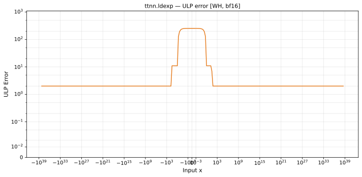

# ldexp — Wormhole (WH), bfloat16
_This page is auto-generated by `ttnn-accuracy report`. Do not edit manually._

_Generated: 2026-08-27 12:58_

**Architecture:** Wormhole (WH)  
**Data type:** bfloat16  

---

[← Wormhole (WH) bfloat16 ops](README.md) | [All archs for ldexp](../../../by_op/ldexp/README.md) | [Top](../../../README.md)

**Measured input range:** all normal values  

| Parameters | Max ULP | Mean ULP | Accurate to \|x\| | Max abs error |
|------------|---------|----------|-----------------|---------------|
| `default` | 255 | 94.5 | — | 3.39e+38 |

**Outcomes**

| Parameters | inexact | overflow |
|------------|------|------|
| `default` | 65,024 | 2 |

_Measured on WORMHOLE_B0 · tt-metal `a5cd86212e1` · ttnn `0.75.0rc10.dev817+g2adf8c65887` · run `20260827T120147`_

