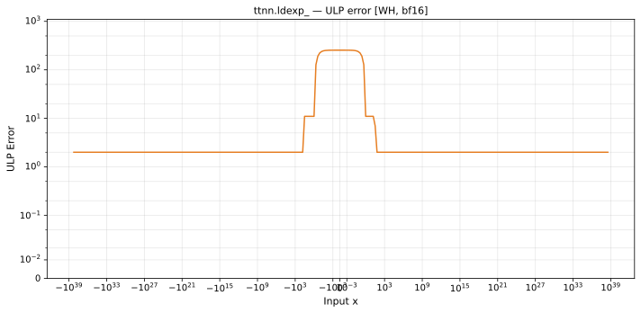

# ldexp_ — Wormhole (WH), bfloat16
_This page is auto-generated by `ttnn-accuracy report`. Do not edit manually._

**Architecture:** Wormhole (WH)  
**Data type:** bfloat16  

---

[← Wormhole (WH) bfloat16 ops](README.md) | [All archs for ldexp_](../../../by_op/ldexp_/README.md) | [Top](../../../README.md)

**Measured input range:** all normal values  

|  | `default` |
|---|---|
| Max ULP | 255 |
| Min ULP | 0.898 |
| Mean ULP | 94.4 |
| Signed bias (ULP) | -0.0851 |
| p50 ULP | 6 |
| p95 ULP | 242 |
| p99 ULP | 253 |
| Exact fraction | 0 |
| Correctly rounded | 0.955 |
| Max abs error | 3.39e+38 |
| Max rel error | 1 |
| Median rel error | 0.027 |
| Bits of precision (worst) | -0 |
| Bits of precision (median) | 5.21 |

**default** — worst pairing 255 ULP; mean 94.4  

**Outcomes**

| Parameters | faithful | inexact | overflow |
|---|---|---|---|
| `default` | 242 | 64,782 | 2 |

**Worst points**

| Parameters | x | x2 | golden | device | ULP |
|---|---|---|---|---|---|
| `default` | 2.3418052e-38 | 182 | 1.4355224e+17 | 7.96875 | 255 |
| `default` | 4.6836103e-38 | 182 | 2.8710448e+17 | 15.9375 | 255 |
| `default` | 9.3672206e-38 | 182 | 5.7420895e+17 | 31.875 | 255 |
| `default` | 1.8734441e-37 | 182 | 1.1484179e+18 | 63.75 | 255 |
| `default` | 3.7468882e-37 | 182 | 2.2968358e+18 | 127.5 | 255 |
| `default` | 7.4937765e-37 | 182 | 4.5936716e+18 | 255 | 255 |
| `default` | 1.4987553e-36 | 182 | 9.187343e+18 | 510 | 255 |
| `default` | 2.9975106e-36 | 182 | 1.8374686e+19 | 1020 | 255 |
| `default` | 5.9950212e-36 | 182 | 3.6749373e+19 | 2040 | 255 |
| `default` | 1.19900424e-35 | 182 | 7.3498746e+19 | 4080 | 255 |

**Non-finite outputs**

| Parameters | Points | Both | Device only | Golden only | Device inf | Device nan | Golden inf | Golden nan |
|---|---|---|---|---|---|---|---|---|
| `default` | 2 | 2 | 0 | 0 | 2 | 0 | 2 | 0 |

| Parameters | x | x2 | golden | device |
|---|---|---|---|---|
| `default` | inf | 0 | inf | inf |
| `default` | -inf | 0 | -inf | -inf |

### Special values

| Variant | x | device | golden |  |
|---|---|---|---|---|
| `default` | 0 | 0 | 0 | agree |
| `default` | -0 | 0 | -0 | **differ** |
| `default` | inf | inf | inf | agree |
| `default` | -inf | -inf | -inf | agree |
| `default` | nan | inf | nan | **differ** |
| `default` | 1.1754944e-38 | 2.3509887e-38 | 2.3509887e-38 | agree |
| `default` | -1.1754944e-38 | -2.3509887e-38 | -2.3509887e-38 | agree |

_Measured on WORMHOLE_B0 · tt-metal `a3a9fb4229a` · ttnn `0.78.0` · run `20260929T112604`_

