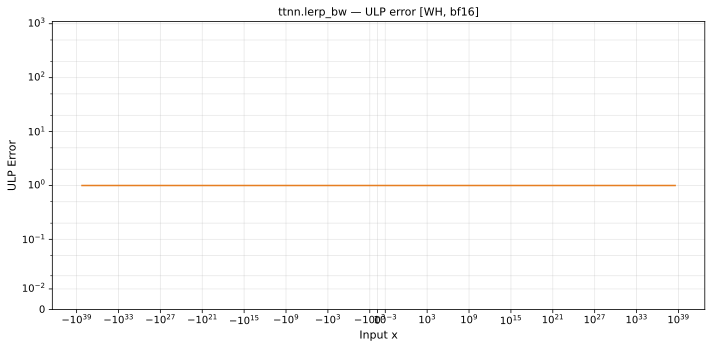

# lerp_bw — Wormhole (WH), bfloat16
_This page is auto-generated by `ttnn-accuracy report`. Do not edit manually._

_Generated: 2026-08-31 09:14_

**Architecture:** Wormhole (WH)  
**Data type:** bfloat16  

---

[← Wormhole (WH) bfloat16 ops](README.md) | [All archs for lerp_bw](../../../by_op/lerp_bw/README.md) | [Top](../../../README.md)

**Measured input range:** all normal values  

| Parameters | Max ULP | Mean ULP | Max abs error |
|------------|---------|----------|---------------|
| `default` | 1 | 1 | 0.00781 |

**default** — within 2 ULP everywhere  

**Outcomes**

| Parameters | inexact |
|------------|------|
| `default` | 65,026 |

> **Sampled, not exhaustive.** For this op the first operand is exhaustive; the second and third take every 512th bf16 code, 128 values each. The figures above are a lower bound on the error, and comparable between releases, but they are not a bound over the dtype.

> **Provenance unknown.** These figures predate run tracking. Re-measure to attribute them.

