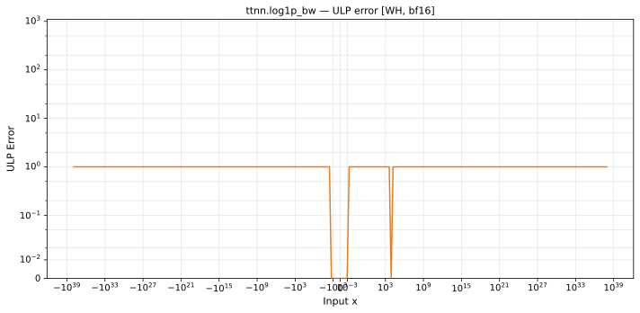

# log1p_bw — Wormhole (WH), bfloat16
_This page is auto-generated by `ttnn-accuracy report`. Do not edit manually._

**Architecture:** Wormhole (WH)  
**Data type:** bfloat16  

---

[← Wormhole (WH) bfloat16 ops](README.md) | [All archs for log1p_bw](../../../by_op/log1p_bw/README.md) | [Top](../../../README.md)

**Measured input range:** x ∈ [-8.507e+37, 8.507e+37]  

|  | `default` |
|---|---|
| Max ULP | 1.42 |
| Min ULP | 0 |
| Mean ULP | 0.68 |
| Signed bias (ULP) | 0.17 |
| p50 ULP | 0.0342 |
| p95 ULP | 0.463 |
| p99 ULP | 0.659 |
| Exact fraction | 0.975 |
| Correctly rounded | 0.975 |
| Accurate to \|x\| | 8.47e+37 |
| Max abs error | 0.167 |
| Max rel error | 0.00632 |
| Median rel error | 0.00366 |
| Bits of precision (worst) | 7.31 |
| Bits of precision (median) | 8.1 |

**default** — 2/64514 defects; rest 1.42 ULP  

**Outcomes**

| Parameters | exact | faithful | inexact | overflow | zeroed |
|---|---|---|---|---|---|
| `default` | 62,909 | 1,416 | 186 | 1 | 2 |

**Worst points**

| Parameters | x | golden | device | ULP |
|---|---|---|---|---|
| `default` | 0.03466797 | 0.96484375 | 0.9609375 | 1.42 |
| `default` | 0.07373047 | 0.9296875 | 0.92578125 | 1.42 |
| `default` | 0.03491211 | 0.96484375 | 0.9609375 | 1.36 |
| `default` | 0.09716797 | 0.91015625 | 0.90625 | 1.33 |
| `default` | 0.07421875 | 0.9296875 | 0.92578125 | 1.31 |
| `default` | 1.1484375 | 0.46484375 | 0.46289062 | 1.31 |
| `default` | 3.296875 | 0.23242188 | 0.23144531 | 1.31 |
| `default` | 7.59375 | 0.11621094 | 0.115722656 | 1.31 |
| `default` | 274 | 0.0036315918 | 0.003616333 | 1.31 |
| `default` | -0.46289062 | 1.859375 | 1.8515625 | 1.31 |

**Monotonicity**

_Checked only where the reference is itself ordered, and never across a discontinuity._

| Parameters | Pairs | Violations | Rate | Worst \|Δy\| |
|---|---|---|---|---|
| `default` | 32,255 | 0 | 0 | 0 |

**Non-finite outputs**

| Parameters | Points | Both | Device only | Golden only | Device inf | Device nan | Golden inf | Golden nan |
|---|---|---|---|---|---|---|---|---|
| `default` | 1 | 1 | 0 | 0 | 1 | 0 | 1 | 0 |

| Parameters | x | golden | device |
|---|---|---|---|
| `default` | -1 | inf | inf |

### Special values

| Variant | x | device | golden |  |
|---|---|---|---|---|
| `default` | 0 | 1 | 1 | agree |
| `default` | -0 | 1 | 1 | agree |
| `default` | inf | 0 | 0 | agree |
| `default` | -inf | 0 | -0 | **differ** |
| `default` | nan | 0 | nan | **differ** |
| `default` | 1.1754944e-38 | 1 | 1 | agree |
| `default` | -1.1754944e-38 | 1 | 1 | agree |

> **Provenance unknown.** These figures predate run tracking. Re-measure to attribute them.

