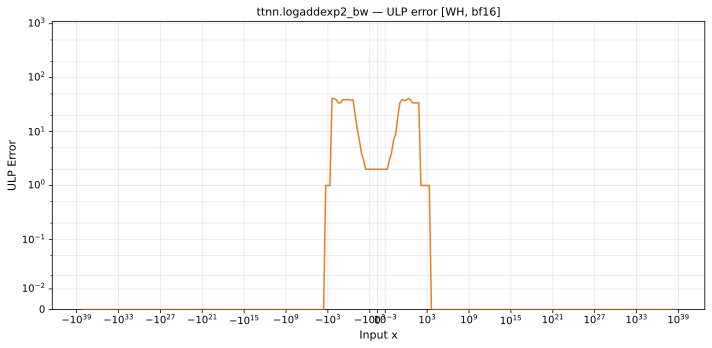

# logaddexp2_bw — Wormhole (WH), bfloat16
_This page is auto-generated by `ttnn-accuracy report`. Do not edit manually._

**Architecture:** Wormhole (WH)  
**Data type:** bfloat16  

---

[← Wormhole (WH) bfloat16 ops](README.md) | [All archs for logaddexp2_bw](../../../by_op/logaddexp2_bw/README.md) | [Top](../../../README.md)

**Measured input range:** all normal values  

|  | `default` |
|---|---|
| Max ULP | 41.4 |
| Min ULP | 0 |
| Mean ULP | 3.6 |
| Signed bias (ULP) | 2.07 |
| p50 ULP | 1.74 |
| p95 ULP | 3.37 |
| p99 ULP | 34.3 |
| Exact fraction | 0.461 |
| Correctly rounded | 0.978 |
| Max abs error | 0.00504 |
| Max rel error | 0.186 |
| Median rel error | 0.0073 |
| Bits of precision (worst) | 2.43 |
| Bits of precision (median) | 7.1 |

**default** — worst sampled pairing  

**Outcomes**

| Parameters | exact | inexact |
|---|---|---|
| `default` | 29,952 | 35,074 |

**Worst points**

| Parameters | x | x2 | golden | device | ULP |
|---|---|---|---|---|---|
| `default` | 2.796875 | 128 | 2.038748e-38 | 1.6622225e-38 | 41.4 |
| `default` | 3.796875 | 128 | 4.077496e-38 | 3.324445e-38 | 41.4 |
| `default` | -128 | -2.796875 | 2.038748e-38 | 1.6622225e-38 | 41.4 |
| `default` | -129 | -3.796875 | 2.038748e-38 | 1.6622225e-38 | 41.4 |
| `default` | 2.78125 | 128 | 2.0203809e-38 | 1.6622225e-38 | 39 |
| `default` | 3.78125 | 128 | 4.0407618e-38 | 3.324445e-38 | 39 |
| `default` | 4.78125 | 128 | 8.0815237e-38 | 6.64889e-38 | 39 |
| `default` | 5.78125 | 128 | 1.6163047e-37 | 1.329778e-37 | 39 |
| `default` | 6.78125 | 128 | 3.2326095e-37 | 2.659556e-37 | 39 |
| `default` | 7.78125 | 128 | 6.465219e-37 | 5.319112e-37 | 39 |

### Special values

| Variant | x | device | golden |  |
|---|---|---|---|---|
| `default` | 0 | 0.33398438 | 0.33398438 | agree |
| `default` | -0 | 0.33398438 | 0.33398438 | agree |
| `default` | inf | 1 | 1 | agree |
| `default` | -inf | 0 | 0 | agree |
| `default` | nan | 1 | nan | **differ** |
| `default` | 1.1754944e-38 | 0.33398438 | 0.33398438 | agree |
| `default` | -1.1754944e-38 | 0.33398438 | 0.33398438 | agree |

_Measured on WORMHOLE_B0 · tt-metal `de546d3b146` · ttnn `0.79.0` · run `20261003T031310`_

