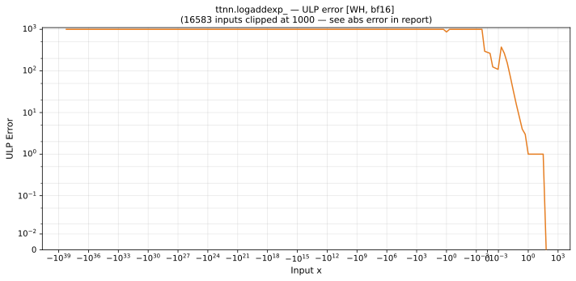

# logaddexp_ — Wormhole (WH), bfloat16
_This page is auto-generated by `ttnn-accuracy report`. Do not edit manually._

**Architecture:** Wormhole (WH)  
**Data type:** bfloat16  

---

[← Wormhole (WH) bfloat16 ops](README.md) | [All archs for logaddexp_](../../../by_op/logaddexp_/README.md) | [Top](../../../README.md)

**Measured input range:** all normal values  

| Parameters | Max ULP | Mean ULP | Max abs error |
|------------|---------|----------|---------------|
| `default` | 8.39e+06 ⚠ | 4.85e+03 | 0.25 |

**default** — 15566 of 65026 points returned inf or zero where a value exists  

**Outcomes**

| Parameters | exact | inexact | mismatch | overflow |
|------------|------|------|------|------|
| `default` | 163 | 49,296 | 15,566 | 1 |

### Special values

| Variant | x | device | golden | |
|---|---|---|---|---|
| `default` | 0 | 1.312 | 1.313 | **differ** |
| `default` | -0 | 1.312 | 1.313 | **differ** |
| `default` | inf | inf | inf | agree |
| `default` | -inf | 1 | 1 | agree |
| `default` | nan | inf | nan | **differ** |
| `default` | 1.175e-38 | 1.312 | 1.313 | **differ** |
| `default` | -1.175e-38 | 1.312 | 1.313 | **differ** |

_Measured on WORMHOLE_B0 · tt-metal `f6deef232f7` · ttnn `0.1.dev30578+g5b8d933` · run `20260904T120341`_

