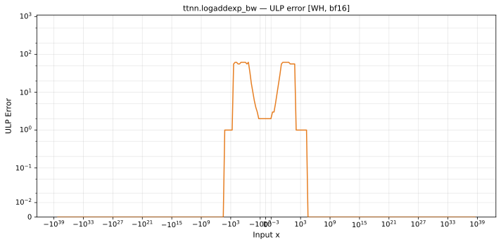

# logaddexp_bw — Wormhole (WH), bfloat16
_This page is auto-generated by `ttnn-accuracy report`. Do not edit manually._

**Architecture:** Wormhole (WH)  
**Data type:** bfloat16  

---

[← Wormhole (WH) bfloat16 ops](README.md) | [All archs for logaddexp_bw](../../../by_op/logaddexp_bw/README.md) | [Top](../../../README.md)

**Measured input range:** all normal values  

|  | `default` |
|---|---|
| Max ULP | 62.5 |
| Min ULP | 0 |
| Mean ULP | 4.9 |
| Signed bias (ULP) | 2.45 |
| p50 ULP | 2.02 |
| p95 ULP | 3.94 |
| p99 ULP | 56.3 |
| Exact fraction | 0.449 |
| Correctly rounded | 0.979 |
| Max abs error | 0.00278 |
| Max rel error | 0.266 |
| Median rel error | 0.00814 |
| Bits of precision (worst) | 1.91 |
| Bits of precision (median) | 6.94 |

**default** — worst pairing 62.5 ULP; mean 4.9  

**Outcomes**

| Parameters | exact | faithful | inexact |
|---|---|---|---|
| `default` | 29,185 | 768 | 35,073 |

**Worst points**

| Parameters | x | x2 | golden | device | ULP |
|---|---|---|---|---|---|
| `default` | -0.21875 | 70.5 | 1.9336337e-31 | 1.456003e-31 | 62.5 |
| `default` | -0.71875 | 70 | 1.9336337e-31 | 1.456003e-31 | 62.5 |
| `default` | -1.21875 | 69.5 | 1.9336337e-31 | 1.456003e-31 | 62.5 |
| `default` | -1.71875 | 69 | 1.9336337e-31 | 1.456003e-31 | 62.5 |
| `default` | -2.21875 | 68.5 | 1.9336337e-31 | 1.456003e-31 | 62.5 |
| `default` | -2.71875 | 68 | 1.9336337e-31 | 1.456003e-31 | 62.5 |
| `default` | -3.21875 | 67.5 | 1.9336337e-31 | 1.456003e-31 | 62.5 |
| `default` | -3.71875 | 67 | 1.9336337e-31 | 1.456003e-31 | 62.5 |
| `default` | -4.21875 | 66.5 | 1.9336337e-31 | 1.456003e-31 | 62.5 |
| `default` | -4.71875 | 66 | 1.9336337e-31 | 1.456003e-31 | 62.5 |

### Special values

| Variant | x | device | golden |  |
|---|---|---|---|---|
| `default` | 0 | 0.26953125 | 0.26953125 | agree |
| `default` | -0 | 0.26953125 | 0.26953125 | agree |
| `default` | inf | 1 | 1 | agree |
| `default` | -inf | 0 | 0 | agree |
| `default` | nan | 1 | nan | **differ** |
| `default` | 1.1754944e-38 | 0.26953125 | 0.26953125 | agree |
| `default` | -1.1754944e-38 | 0.26953125 | 0.26953125 | agree |

> **Provenance unknown.** These figures predate run tracking. Re-measure to attribute them.

