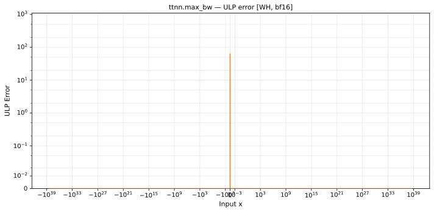

# max_bw — Wormhole (WH), bfloat16
_This page is auto-generated by `ttnn-accuracy report`. Do not edit manually._

_Generated: 2026-08-31 08:49_

**Architecture:** Wormhole (WH)  
**Data type:** bfloat16  

---

[← Wormhole (WH) bfloat16 ops](README.md) | [All archs for max_bw](../../../by_op/max_bw/README.md) | [Top](../../../README.md)

**Measured input range:** all normal values  

| Parameters | Max ULP | Mean ULP | Max abs error |
|------------|---------|----------|---------------|
| `default` | 64 | 64 | 0.5 |

**default** — worst pairing 64 ULP; mean 64  

**Outcomes**

| Parameters | exact | inexact |
|------------|------|------|
| `default` | 63,234 | 1,792 |

> **Provenance unknown.** These figures predate run tracking. Re-measure to attribute them.

