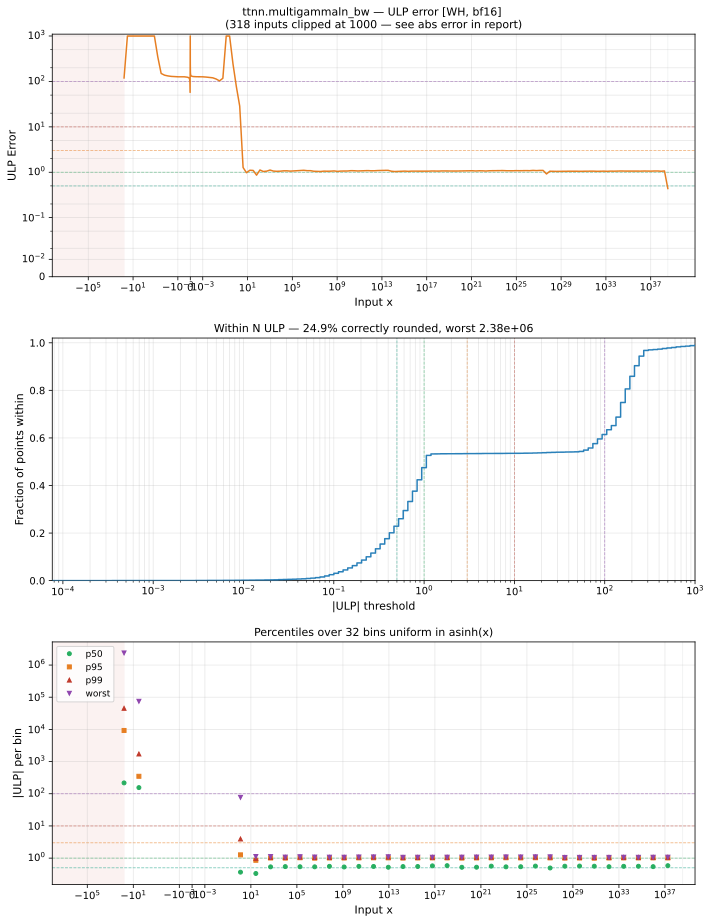

# multigammaln_bw — Wormhole (WH), bfloat16
_This page is auto-generated by `ttnn-accuracy report`. Do not edit manually._

_Generated: 2026-09-01 07:57_

**Architecture:** Wormhole (WH)  
**Data type:** bfloat16  

---

[← Wormhole (WH) bfloat16 ops](README.md) | [All archs for multigammaln_bw](../../../by_op/multigammaln_bw/README.md) | [Top](../../../README.md)

**Measured input range:** x ∈ [-63.75, 3.39e+38]  

| Parameters | Max ULP | Mean ULP | Accurate to \|x\| | Max abs error |
|---|---|---|---|---------------|
| `default` | 2.38e+06 ⚠ | 294 | 5.59e-17 | 2.34e+16 |

**default** — accurate to |x| <= 5.59e-17; up to 2.38e+06 ULP beyond  

**Outcomes**

| Parameters | exact | inexact | mismatch |
|------------|------|------|------|
| `default` | 7,598 | 23,118 | 18,692 |

### Special values

| Variant | x | device | golden | |
|---|---|---|---|---|
| `default` | 0 | -3.359e+05 | nan | **differ** |
| `default` | -0 | -3.359e+05 | nan | **differ** |
| `default` | inf | inf | inf | agree |
| `default` | -inf | -inf | nan | **differ** |
| `default` | nan | inf | nan | **differ** |
| `default` | 1.175e-38 | -3.359e+05 | nan | **differ** |
| `default` | -1.175e-38 | -3.359e+05 | nan | **differ** |

_Measured on WORMHOLE_B0 · tt-metal `047ec3ccf96` · ttnn `0.1.dev30578+g5b8d933` · run `20260901T075510`_

