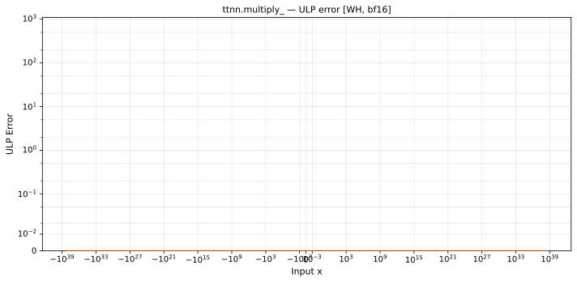

# multiply_ — Wormhole (WH), bfloat16
_This page is auto-generated by `ttnn-accuracy report`. Do not edit manually._

**Architecture:** Wormhole (WH)  
**Data type:** bfloat16  

---

[← Wormhole (WH) bfloat16 ops](README.md) | [All archs for multiply_](../../../by_op/multiply_/README.md) | [Top](../../../README.md)

**Measured input range:** all normal values  

|  | `default` |
|---|---|
| Max ULP | 0.5 |
| Min ULP | 0 |
| Mean ULP | 0 |
| Signed bias (ULP) | 0 |
| p50 ULP | 0.5 |
| p95 ULP | 0.5 |
| p99 ULP | 0.5 |
| Exact fraction | 1 |
| Correctly rounded | 1 |
| Max abs error | 0.0156 |
| Max rel error | 0.00386 |
| Median rel error | 0 |
| Bits of precision (worst) | 8.02 |
| Bits of precision (median) | — |

**default** — bit-exact  

**Outcomes**

| Parameters | exact | mismatch |
|---|---|---|
| `default` | 65,024 | 2 |

**Worst points**

| Parameters | x | x2 | golden | device | ULP |
|---|---|---|---|---|---|
| `default` | 1.1846779e-38 | 1.5 | 1.7816086e-38 | 1.7816086e-38 | 0.5 |
| `default` | 1.1938615e-38 | 1.25 | 1.487735e-38 | 1.487735e-38 | 0.5 |
| `default` | 1.203045e-38 | 1.5 | 1.7999757e-38 | 1.7999757e-38 | 0.5 |
| `default` | 1.2122285e-38 | 1.125 | 1.3591653e-38 | 1.3591653e-38 | 0.5 |
| `default` | 1.2214121e-38 | 1.5 | 1.8367099e-38 | 1.8367099e-38 | 0.5 |
| `default` | 1.2305956e-38 | 1.25 | 1.5428363e-38 | 1.5428363e-38 | 0.5 |
| `default` | 1.2397792e-38 | 1.5 | 1.855077e-38 | 1.855077e-38 | 0.5 |
| `default` | 1.2489627e-38 | 1.0625 | 1.3224311e-38 | 1.3224311e-38 | 0.5 |
| `default` | 1.2581463e-38 | 1.5 | 1.8918112e-38 | 1.8918112e-38 | 0.5 |
| `default` | 1.2673298e-38 | 1.25 | 1.5795705e-38 | 1.5795705e-38 | 0.5 |

**Non-finite outputs**

| Parameters | Points | Both | Device only | Golden only | Device inf | Device nan | Golden inf | Golden nan |
|---|---|---|---|---|---|---|---|---|
| `default` | 2 | 0 | 0 | 2 | 0 | 0 | 0 | 2 |

| Parameters | x | x2 | golden | device |
|---|---|---|---|---|
| `default` | inf | 0 | nan | 0 |
| `default` | -inf | 0 | nan | 0 |

### Special values

| Variant | x | device | golden |  |
|---|---|---|---|---|
| `default` | 0 | 0 | 0 | agree |
| `default` | -0 | 0 | -0 | **differ** |
| `default` | inf | inf | inf | agree |
| `default` | -inf | -inf | -inf | agree |
| `default` | nan | inf | nan | **differ** |
| `default` | 1.1754944e-38 | 1.1754944e-38 | 1.1754944e-38 | agree |
| `default` | -1.1754944e-38 | -1.1754944e-38 | -1.1754944e-38 | agree |

_Measured on WORMHOLE_B0 · tt-metal `de546d3b146` · ttnn `0.79.0` · run `20261003T030142`_

