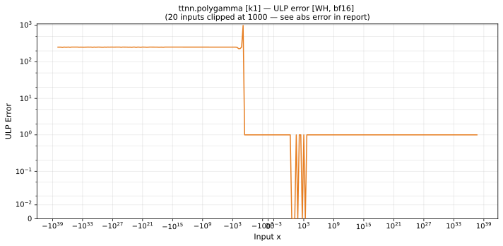

# polygamma — Wormhole (WH), bfloat16
_This page is auto-generated by `ttnn-accuracy report`. Do not edit manually._

**Architecture:** Wormhole (WH)  
**Data type:** bfloat16  

---

[← Wormhole (WH) bfloat16 ops](README.md) | [All archs for polygamma](../../../by_op/polygamma/README.md) | [Top](../../../README.md)

**Measured input range:** x ∈ [-3.39e+38, 8.507e+37]  

| Parameters | Max ULP | Mean ULP | Accurate to \|x\| | Max abs error |
|---|---|---|---|---------------|
| `k=1` | 1.02e+08 ⚠ | 1.32e+04 | 0.996 | 6.44e+36 |

**k=1** — 263 of 64769 points returned inf or zero where a value exists · _trigamma, the first order in use_  

**Outcomes**

| Parameters | exact | inexact | mismatch | overflow | zeroed |
|------------|------|------|------|------|------|
| `k=1` | 32,294 | 16,338 | 6 | 15,874 | 257 |

### Special values

| Variant | x | device | golden | |
|---|---|---|---|---|
| `k=1` | 0 | inf | inf | agree |
| `k=1` | -0 | inf | inf | agree |
| `k=1` | inf | 0 | 0 | agree |
| `k=1` | -inf | 0 | nan | **differ** |
| `k=1` | nan | 0 | nan | **differ** |
| `k=1` | 1.175e-38 | inf | inf | agree |
| `k=1` | -1.175e-38 | inf | inf | agree |

_Measured on WORMHOLE_B0 · tt-metal `f6deef232f7` · ttnn `0.1.dev30578+g5b8d933` · run `20260904T120341`_

