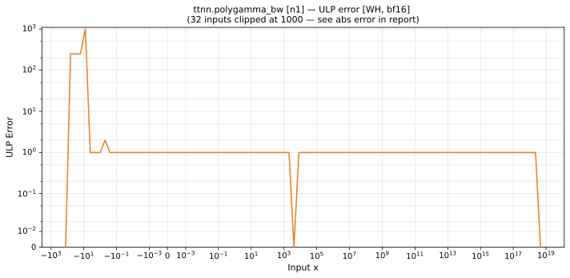

# polygamma_bw — Wormhole (WH), bfloat16
_This page is auto-generated by `ttnn-accuracy report`. Do not edit manually._

**Architecture:** Wormhole (WH)  
**Data type:** bfloat16  

---

[← Wormhole (WH) bfloat16 ops](README.md) | [All archs for polygamma_bw](../../../by_op/polygamma_bw/README.md) | [Top](../../../README.md)

**Measured input range:** x ≥ -1024  

|  | `n=1` |
|---|---|
| Max ULP | 3.57e+08 ⚠ |
| Min ULP | 0 |
| Mean ULP | 6.81e+05 |
| Signed bias (ULP) | 6.81e+05 |
| p50 ULP | 0.238 |
| p95 ULP | 0.502 |
| p99 ULP | 241 |
| Exact fraction | 0.945 |
| Correctly rounded | 0.945 |
| Accurate to \|x\| | 4.47 |
| Max abs error | 7.06e+35 |
| Max rel error | 2.79e+06 |
| Median rel error | 0.00295 |
| Bits of precision (worst) | -21.4 |
| Bits of precision (median) | 8.41 |

**n=1** — 75 of 49922 points returned inf or zero where a value exists; the rest reach 3.57e+08 ULP · _trigamma; swept above -1024, where torch can still compute the reference_  

**Outcomes**

| Parameters | exact | faithful | flushed | inexact | mismatch | overflow | zeroed |
|---|---|---|---|---|---|---|---|
| `n=1` | 18,527 | 728 | 8,319 | 360 | 507 | 21,406 | 75 |

**Worst points**

| Parameters | x | golden | device | ULP |
|---|---|---|---|---|
| `n=1` | -6.03125 | 65536 | -1.8253611e+11 | 3.57e+08 |
| `n=1` | -5.96875 | -65536 | -1.8253611e+11 | 3.57e+08 |
| `n=1` | -6.0625 | 8192 | -713031700 | 1.11e+07 |
| `n=1` | -5.9375 | -8192 | -713031700 | 1.11e+07 |
| `n=1` | -6.09375 | 2432 | -27656192 | 1.73e+06 |
| `n=1` | -5.90625 | -2432 | -27656192 | 1.73e+06 |
| `n=1` | -6.125 | 1024 | -2752512 | 3.44e+05 |
| `n=1` | -5.875 | -1024 | -2752512 | 3.44e+05 |
| `n=1` | -6.5 | -0.020263672 | -35.25 | 2.89e+05 |
| `n=1` | -5.5 | -0.02758789 | -35.25 | 2.89e+05 |

**Monotonicity**

_Checked only where the reference is itself ordered, and never across a discontinuity._

| Parameters | Pairs | Violations | Rate | Worst \|Δy\| |
|---|---|---|---|---|
| `n=1` | 13,417 | 0 | 0 | 0 |

**Non-finite outputs**

| Parameters | Points | Both | Device only | Golden only | Device inf | Device nan | Golden inf | Golden nan |
|---|---|---|---|---|---|---|---|---|
| `n=1` | 21,913 | 21,406 | 0 | 507 | 21,406 | 0 | 21,912 | 1 |

| Parameters | x | golden | device |
|---|---|---|---|
| `n=1` | 1.1754944e-38 | -inf | -inf |
| `n=1` | 1.1846779e-38 | -inf | -inf |
| `n=1` | 1.1938615e-38 | -inf | -inf |
| `n=1` | 1.203045e-38 | -inf | -inf |
| `n=1` | 1.2122285e-38 | -inf | -inf |
| `n=1` | 1.2214121e-38 | -inf | -inf |
| `n=1` | 1.2305956e-38 | -inf | -inf |
| `n=1` | 1.2397792e-38 | -inf | -inf |
| `n=1` | 1.2489627e-38 | -inf | -inf |
| `n=1` | 1.2581463e-38 | -inf | -inf |

### Special values

| Variant | x | device | golden |  |
|---|---|---|---|---|
| `n=1` | 0 | -inf | -inf | agree |
| `n=1` | -0 | -inf | -inf | agree |
| `n=1` | inf | 0 | nan | **differ** |
| `n=1` | -inf | 0 | -inf | **differ** |
| `n=1` | nan | 0 | nan | **differ** |
| `n=1` | 1.1754944e-38 | -inf | -inf | agree |
| `n=1` | -1.1754944e-38 | inf | inf | agree |

_Measured on WORMHOLE_B0 · tt-metal `a3a9fb4229a` · ttnn `0.78.0` · run `20260929T111615`_

