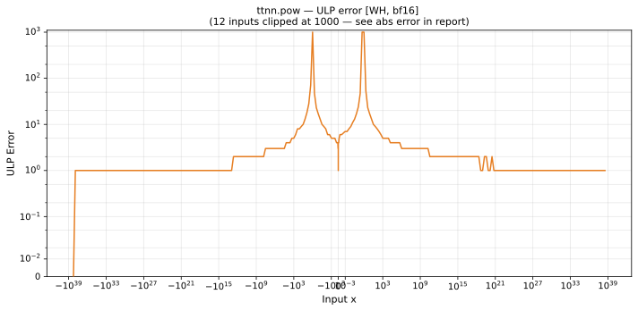

# pow — Wormhole (WH), bfloat16
_This page is auto-generated by `ttnn-accuracy report`. Do not edit manually._

**Architecture:** Wormhole (WH)  
**Data type:** bfloat16  

---

[← Wormhole (WH) bfloat16 ops](README.md) | [All archs for pow](../../../by_op/pow/README.md) | [Top](../../../README.md)

**Measured input range:** all normal values  

|  | `default` |
|---|---|
| Max ULP | 4.86e+18 ⚠ |
| Min ULP | 0 |
| Mean ULP | 2.08e+14 |
| Signed bias (ULP) | -2.08e+14 |
| p50 ULP | 0.899 |
| p95 ULP | 3.45 |
| p99 ULP | 16.3 |
| Exact fraction | 0.282 |
| Correctly rounded | 0.982 |
| Max abs error | 2.31e+38 |
| Max rel error | 1.95e+16 |
| Median rel error | 0.00471 |
| Bits of precision (worst) | -54.1 |
| Bits of precision (median) | 7.73 |

**default** — worst pairing 4.86e+18 ULP; mean 2.08e+14  

**Outcomes**

| Parameters | exact | faithful | inexact |
|---|---|---|---|
| `default` | 18,360 | 23,112 | 23,554 |

**Worst points**

| Parameters | x | x2 | golden | device | ULP |
|---|---|---|---|---|---|
| `default` | 0.99609375 | 22144 | 2.2867039e-38 | 4.4667753e-22 | 4.86e+18 |
| `default` | -0.99609375 | 22144 | 2.2867039e-38 | 4.4667753e-22 | 4.86e+18 |
| `default` | 0.9921875 | 11072 | 1.9285454e-38 | 1.648596e-31 | 1.8e+09 |
| `default` | -0.9921875 | 11072 | 1.9285454e-38 | 1.648596e-31 | 1.8e+09 |
| `default` | 0.98828125 | 7360 | 2.0938493e-38 | 1.4519706e-34 | 1.58e+06 |
| `default` | -0.98828125 | 7360 | 2.0938493e-38 | 1.4519706e-34 | 1.58e+06 |
| `default` | 0.984375 | 5504 | 2.2683368e-38 | 4.819527e-36 | 5.22e+04 |
| `default` | -0.984375 | 5504 | 2.2683368e-38 | 4.819527e-36 | 5.22e+04 |
| `default` | 0.98046875 | 4288 | 1.8514036e-37 | 4.772507e-36 | 6.24e+03 |
| `default` | -0.98046875 | 4288 | 1.8514036e-37 | 4.772507e-36 | 6.24e+03 |

### Special values

| Variant | x | device | golden |  |
|---|---|---|---|---|
| `default` | 0 | 0 | 0 | agree |
| `default` | -0 | 0 | -0 | **differ** |
| `default` | inf | inf | inf | agree |
| `default` | -inf | -inf | -inf | agree |
| `default` | nan | inf | nan | **differ** |
| `default` | 1.1754944e-38 | 1.1754944e-38 | 1.1754944e-38 | agree |
| `default` | -1.1754944e-38 | -1.1754944e-38 | -1.1754944e-38 | agree |

_Measured on WORMHOLE_B0 · tt-metal `a3a9fb4229a` · ttnn `0.78.0` · run `20260920T190031`_

