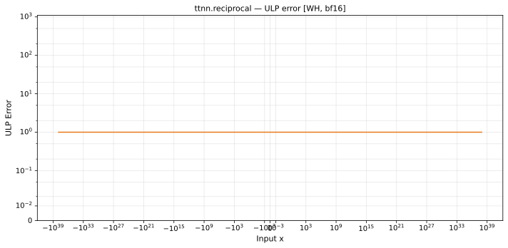

# reciprocal — Wormhole (WH), bfloat16
_This page is auto-generated by `ttnn-accuracy report`. Do not edit manually._

**Architecture:** Wormhole (WH)  
**Data type:** bfloat16  

---

[← Wormhole (WH) bfloat16 ops](README.md) | [All archs for reciprocal](../../../by_op/reciprocal/README.md) | [Top](../../../README.md)

**Measured input range:** x ∈ [-8.507e+37, 8.507e+37]  

| Parameters | Max ULP | Mean ULP | Accurate to \|x\| | Max abs error |
|---|---|---|---|---------------|
| `default` | 1 | 1 | 8.47e+37 | 3.32e+35 |

**default** — 2 of 64514 points returned inf or zero where a value exists  

**Outcomes**

| Parameters | exact | inexact | zeroed |
|------------|------|------|------|
| `default` | 63,504 | 1,008 | 2 |

### Special values

| Variant | x | device | golden | |
|---|---|---|---|---|
| `default` | 0 | inf | inf | agree |
| `default` | -0 | -inf | -inf | agree |
| `default` | inf | 0 | 0 | agree |
| `default` | -inf | 0 | -0 | **differ** |
| `default` | nan | 0 | nan | **differ** |
| `default` | 1.175e-38 | 8.507e+37 | 8.507e+37 | agree |
| `default` | -1.175e-38 | -8.507e+37 | -8.507e+37 | agree |

_Measured on WORMHOLE_B0 · tt-metal `f6deef232f7` · ttnn `0.1.dev30578+g5b8d933` · run `20260904T120341`_

