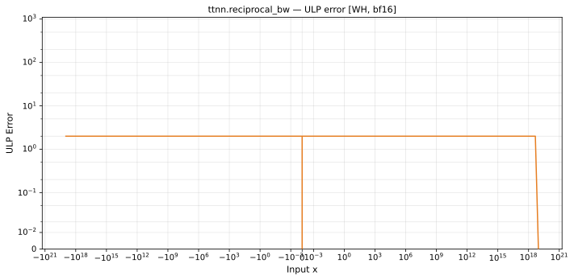

# reciprocal_bw — Wormhole (WH), bfloat16
_This page is auto-generated by `ttnn-accuracy report`. Do not edit manually._

_Generated: 2026-08-31 08:14_

**Architecture:** Wormhole (WH)  
**Data type:** bfloat16  

---

[← Wormhole (WH) bfloat16 ops](README.md) | [All archs for reciprocal_bw](../../../by_op/reciprocal_bw/README.md) | [Top](../../../README.md)

**Measured input range:** x ∈ [-9.223e+18, 9.223e+18]  

| Parameters | Max ULP | Mean ULP | Accurate to \|x\| | Max abs error |
|------------|---------|----------|-----------------|---------------|
| `default` | 2 | 1.02 | 9.22e+18 | 3.32e+35 |

**default** — within 2 ULP everywhere  

**Outcomes**

| Parameters | exact | inexact | mismatch | overflow | zeroed |
|------------|------|------|------|------|------|
| `default` | 19,908 | 12,348 | 254 | 15,874 | 2 |

### Special values

| Variant | x | device | golden | |
|---|---|---|---|---|
| `default` | 0 | -inf | -inf | agree |
| `default` | -0 | -inf | -inf | agree |
| `default` | inf | 0 | -0 | **differ** |
| `default` | -inf | 0 | -0 | **differ** |
| `default` | nan | 0 | nan | **differ** |
| `default` | 1.175e-38 | -inf | -inf | agree |
| `default` | -1.175e-38 | -inf | -inf | agree |

_Measured on WORMHOLE_B0 · tt-metal `2adf8c65887` · ttnn `0.75.0rc10.dev817+g2adf8c65887` · run `20260831T073412`_

