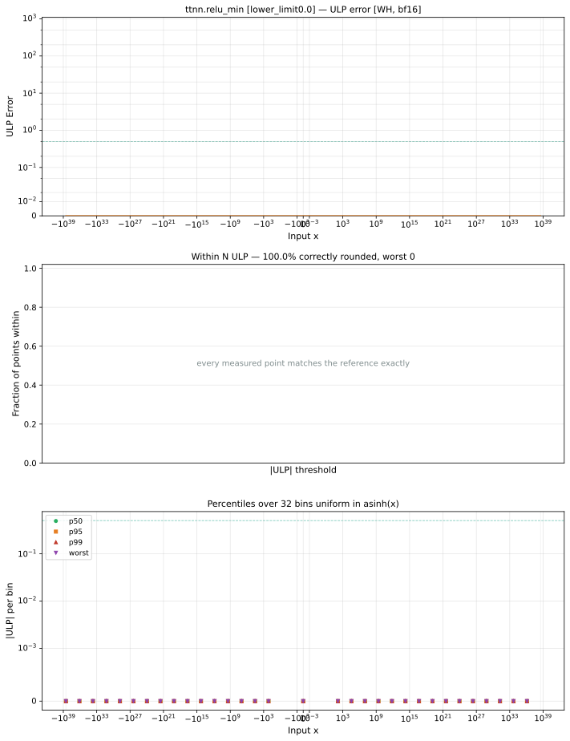

# relu_min — Wormhole (WH), bfloat16
_This page is auto-generated by `ttnn-accuracy report`. Do not edit manually._

**Architecture:** Wormhole (WH)  
**Data type:** bfloat16  

---

[← Wormhole (WH) bfloat16 ops](README.md) | [All archs for relu_min](../../../by_op/relu_min/README.md) | [Top](../../../README.md)

**Measured input range:** x ∈ [-3.39e+38, 3.39e+38]  

| Parameters | Max ULP | Mean ULP | Accurate to \|x\| | Max abs error |
|---|---|---|---|---------------|
| `lower_limit=0.0` | 0 | — | 3.39e+38 | 0 |
| `lower_limit=1.0` | 0 | — | 3.39e+38 | 0 |

**lower_limit=0.0** — bit-exact · _degenerates to relu_  
**lower_limit=1.0** — bit-exact · _unit clamp, the registry's midpoint_  

**Outcomes**

| Parameters | exact |
|------------|------|
| `lower_limit=0.0` | 65,024 |
| `lower_limit=1.0` | 65,024 |

### Special values

| Variant | x | device | golden | |
|---|---|---|---|---|
| `lower_limit=0.0` | 0 | 0 | 0 | agree |
| `lower_limit=0.0` | -0 | 0 | 0 | agree |
| `lower_limit=0.0` | inf | inf | inf | agree |
| `lower_limit=0.0` | -inf | 0 | 0 | agree |
| `lower_limit=0.0` | nan | inf | nan | **differ** |
| `lower_limit=0.0` | 1.175e-38 | 1.175e-38 | 1.175e-38 | agree |
| `lower_limit=0.0` | -1.175e-38 | 0 | 0 | agree |
| `lower_limit=1.0` | 0 | 1 | 1 | agree |
| `lower_limit=1.0` | -0 | 1 | 1 | agree |
| `lower_limit=1.0` | inf | inf | inf | agree |
| `lower_limit=1.0` | -inf | 1 | 1 | agree |
| `lower_limit=1.0` | nan | inf | nan | **differ** |
| `lower_limit=1.0` | 1.175e-38 | 1 | 1 | agree |
| `lower_limit=1.0` | -1.175e-38 | 1 | 1 | agree |

_Measured on WORMHOLE_B0 · tt-metal `9f9cd4fd590` · ttnn `0.77.0` · run `20260915T152226`_

### `lower_limit=0.0`

### `lower_limit=1.0`

