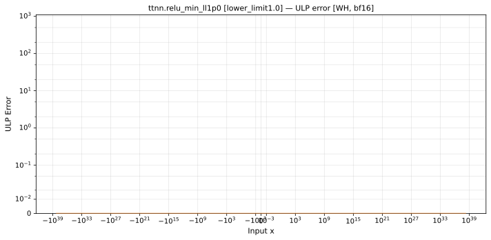

# relu_min — Wormhole (WH), bfloat16
_This page is auto-generated by `scripts/generate_reports.py`. Do not edit manually._

_Generated: 2026-04-28 11:10 UTC_

**Operation:** `relu_min_ll1p0`  
**Architecture:** Wormhole (WH)  
**Data type:** bfloat16  
**Notes:** relu_min lower_limit=1.0  

---

[← Wormhole (WH) bfloat16 ops](README.md) | [All archs for relu_min](../../../by_op/relu_min_ll1p0/README.md) | [Top](../../../README.md)

## Variant: `lower limit1.0`

| Metric | Value |
|--------|-------|
| Max ULP error | 0 |
| Mean ULP error | 0 |
| Max absolute error | 0 |

