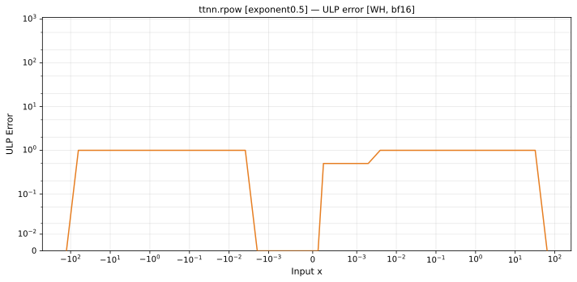
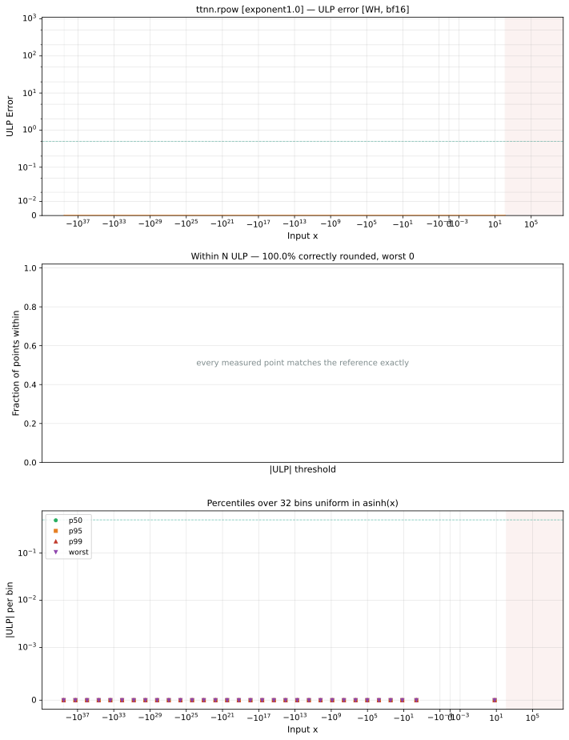
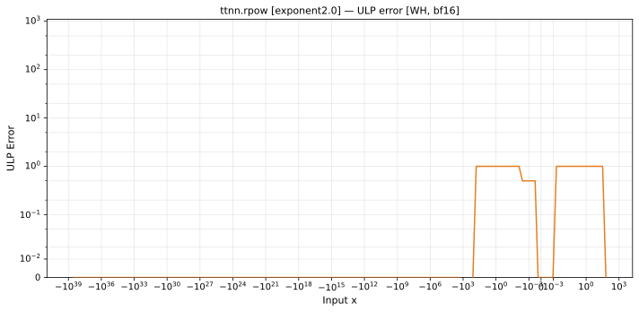

# rpow — Wormhole (WH), bfloat16
_This page is auto-generated by `ttnn-accuracy report`. Do not edit manually._

**Architecture:** Wormhole (WH)  
**Data type:** bfloat16  

---

[← Wormhole (WH) bfloat16 ops](README.md) | [All archs for rpow](../../../by_op/rpow/README.md) | [Top](../../../README.md)

**Measured input range:** x ∈ [-3.39e+38, 127.5]  

|  | `exponent=0.5` | `exponent=1.0` | `exponent=2.0` |
|---|---|---|---|
| Max ULP | 0.898 | 0 | 0.898 |
| Min ULP | 0 | 0 | 0 |
| Mean ULP | 0.564 | 0 | 0.564 |
| Signed bias (ULP) | 0.0659 | 0 | 0.0659 |
| p50 ULP | 0 | 0 | 0 |
| p95 ULP | 0.345 | 0 | 0.224 |
| p99 ULP | 0.655 | 0 | 0.597 |
| Exact fraction | 0.964 | 1 | 0.975 |
| Correctly rounded | 0.975 | 1 | 0.983 |
| Accurate to \|x\| | 3.39e+38 | 3.39e+38 | 3.39e+38 |
| Max abs error | 2.57e+34 | 0 | 2.57e+34 |
| Max rel error | 0.00549 | 0 | 0.00549 |
| Median rel error | 0.00339 | 0 | 0.00339 |
| Bits of precision (worst) | 7.51 | — | 7.51 |
| Bits of precision (median) | 8.2 | — | 8.2 |

**exponent=0.5** — faithfully rounded; 1239 of 49536 points took the other neighbour · _the square-root path, a half-integer_  
**exponent=1.0** — bit-exact · _degenerates to identity_  
**exponent=2.0** — faithfully rounded; 1239 of 49536 points took the other neighbour · _squaring_  

**Outcomes**

| Parameters | exact | faithful | flushed | mismatch | overflow |
|---|---|---|---|---|---|
| `exponent=0.5` | 32,806 | 1,239 | 3 | 2,816 | 12,672 |
| `exponent=1.0` | 49,536 | 0 | 0 | 0 | 0 |
| `exponent=2.0` | 47,903 | 1,239 | 394 | 0 | 0 |

**Worst points**

| Parameters | x | golden | device | ULP |
|---|---|---|---|---|
| `exponent=0.5` | 0.006225586 | 0.99609375 | 0.9921875 | 0.898 |
| `exponent=0.5` | 0.0062561035 | 0.99609375 | 0.9921875 | 0.892 |
| `exponent=0.5` | 0.006286621 | 0.99609375 | 0.9921875 | 0.887 |
| `exponent=0.5` | 0.0063171387 | 0.99609375 | 0.9921875 | 0.882 |
| `exponent=0.5` | 0.0063476562 | 0.99609375 | 0.9921875 | 0.876 |
| `exponent=0.5` | 0.006378174 | 0.99609375 | 0.9921875 | 0.871 |
| `exponent=0.5` | 0.0064086914 | 0.99609375 | 0.9921875 | 0.865 |
| `exponent=0.5` | 0.006439209 | 0.99609375 | 0.9921875 | 0.86 |
| `exponent=0.5` | 0.0064697266 | 0.99609375 | 0.9921875 | 0.855 |
| `exponent=0.5` | 0.24414062 | 0.84375 | 0.84765625 | 0.854 |
| `exponent=2.0` | -0.006225586 | 0.99609375 | 0.9921875 | 0.898 |
| `exponent=2.0` | -0.0062561035 | 0.99609375 | 0.9921875 | 0.892 |
| `exponent=2.0` | -0.006286621 | 0.99609375 | 0.9921875 | 0.887 |
| `exponent=2.0` | -0.0063171387 | 0.99609375 | 0.9921875 | 0.882 |
| `exponent=2.0` | -0.0063476562 | 0.99609375 | 0.9921875 | 0.876 |
| `exponent=2.0` | -0.006378174 | 0.99609375 | 0.9921875 | 0.871 |
| `exponent=2.0` | -0.0064086914 | 0.99609375 | 0.9921875 | 0.865 |
| `exponent=2.0` | -0.006439209 | 0.99609375 | 0.9921875 | 0.86 |
| `exponent=2.0` | -0.0064697266 | 0.99609375 | 0.9921875 | 0.855 |
| `exponent=2.0` | -0.24414062 | 0.84375 | 0.84765625 | 0.854 |

**Monotonicity**

_Checked only where the reference is itself ordered, and never across a discontinuity._

| Parameters | Pairs | Violations | Rate | Worst \|Δy\| |
|---|---|---|---|---|
| `exponent=0.5` | 34,043 | 0 | 0 | 0 |
| `exponent=1.0` | 49,534 | 0 | 0 | 0 |
| `exponent=2.0` | 49,139 | 0 | 0 | 0 |

**Non-finite outputs**

| Parameters | Points | Both | Device only | Golden only | Device inf | Device nan | Golden inf | Golden nan |
|---|---|---|---|---|---|---|---|---|
| `exponent=0.5` | 15,488 | 12,672 | 0 | 2,816 | 12,672 | 0 | 15,488 | 0 |

| Parameters | x | golden | device |
|---|---|---|---|
| `exponent=0.5` | -128 | inf | inf |
| `exponent=0.5` | -129 | inf | inf |
| `exponent=0.5` | -130 | inf | inf |
| `exponent=0.5` | -131 | inf | inf |
| `exponent=0.5` | -132 | inf | inf |
| `exponent=0.5` | -133 | inf | inf |
| `exponent=0.5` | -134 | inf | inf |
| `exponent=0.5` | -135 | inf | inf |
| `exponent=0.5` | -136 | inf | inf |
| `exponent=0.5` | -137 | inf | inf |

### Special values

| Variant | x | device | golden |  |
|---|---|---|---|---|
| `exponent=0.5` | 0 | 1 | 1 | agree |
| `exponent=0.5` | -0 | 1 | 1 | agree |
| `exponent=0.5` | inf | 0 | 0 | agree |
| `exponent=0.5` | -inf | inf | inf | agree |
| `exponent=0.5` | nan | 0 | nan | **differ** |
| `exponent=0.5` | 1.1754944e-38 | 1 | 1 | agree |
| `exponent=0.5` | -1.1754944e-38 | 1 | 1 | agree |
| `exponent=1.0` | 0 | 1 | 1 | agree |
| `exponent=1.0` | -0 | 1 | 1 | agree |
| `exponent=1.0` | inf | inf | 1 | **differ** |
| `exponent=1.0` | -inf | 0 | 1 | **differ** |
| `exponent=1.0` | nan | inf | 1 | **differ** |
| `exponent=1.0` | 1.1754944e-38 | 1 | 1 | agree |
| `exponent=1.0` | -1.1754944e-38 | 1 | 1 | agree |
| `exponent=2.0` | 0 | 1 | 1 | agree |
| `exponent=2.0` | -0 | 1 | 1 | agree |
| `exponent=2.0` | inf | inf | inf | agree |
| `exponent=2.0` | -inf | 0 | 0 | agree |
| `exponent=2.0` | nan | inf | nan | **differ** |
| `exponent=2.0` | 1.1754944e-38 | 1 | 1 | agree |
| `exponent=2.0` | -1.1754944e-38 | 1 | 1 | agree |

_Measured on WORMHOLE_B0 · tt-metal `a3a9fb4229a` · ttnn `0.78.0` · run `20260920T190031`_

### `exponent=0.5`

### `exponent=1.0`

### `exponent=2.0`

