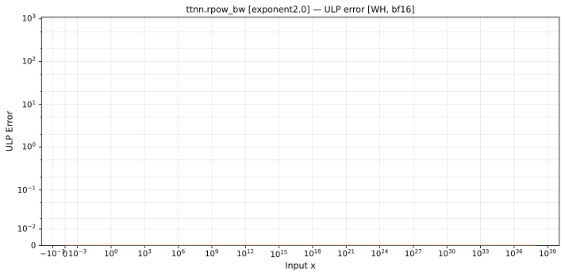

# rpow_bw — Wormhole (WH), bfloat16
_This page is auto-generated by `ttnn-accuracy report`. Do not edit manually._

_Generated: 2026-08-31 08:09_

**Architecture:** Wormhole (WH)  
**Data type:** bfloat16  

---

[← Wormhole (WH) bfloat16 ops](README.md) | [All archs for rpow_bw](../../../by_op/rpow_bw/README.md) | [Top](../../../README.md)

**Measured input range:** x ∈ [-1.695e+38, 1.695e+38]  

| Parameters | Max ULP | Mean ULP | Accurate to \|x\| | Max abs error |
|------------|---------|----------|-----------------|---------------|
| `exponent=2.0` | 0 | — | 1.69e+38 | 0 |

**exponent=2.0** — bit-exact · _squaring_  

**Outcomes**

| Parameters | exact | mismatch |
|------------|------|------|
| `exponent=2.0` | 32,384 | 32,384 |

### Special values

| Variant | x | device | golden | |
|---|---|---|---|---|
| `exponent=2.0` | 0 | 0 | 0 | agree |
| `exponent=2.0` | -0 | 0 | -0 | **differ** |
| `exponent=2.0` | inf | inf | inf | agree |
| `exponent=2.0` | -inf | inf | -inf | **differ** |
| `exponent=2.0` | nan | inf | nan | **differ** |
| `exponent=2.0` | 1.175e-38 | 2.351e-38 | 2.351e-38 | agree |
| `exponent=2.0` | -1.175e-38 | inf | -2.351e-38 | **differ** |

_Measured on WORMHOLE_B0 · tt-metal `2adf8c65887` · ttnn `0.75.0rc10.dev817+g2adf8c65887` · run `20260831T073412`_

