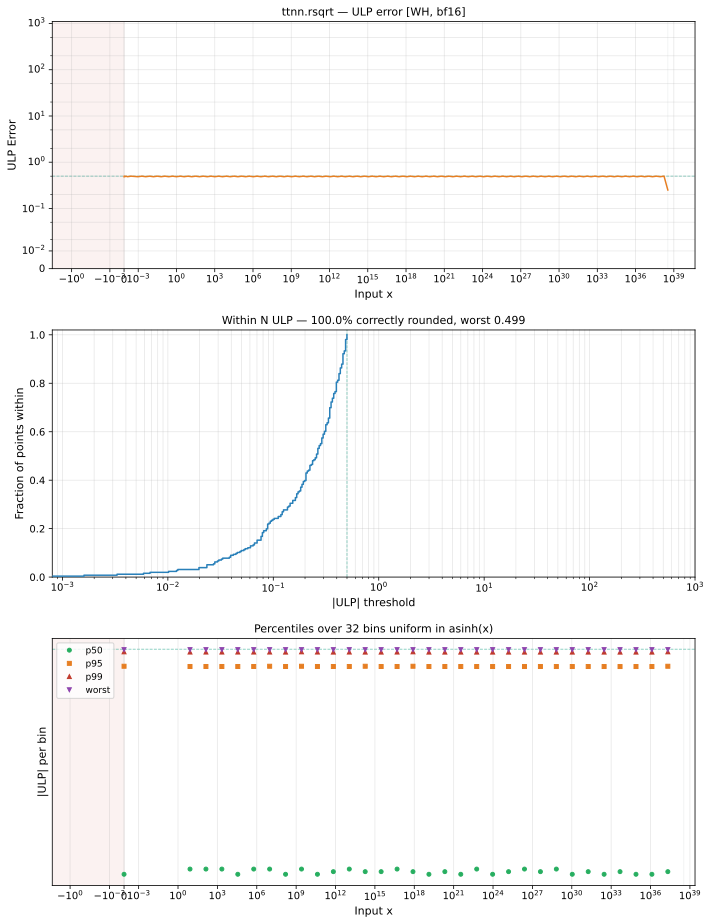

# rsqrt — Wormhole (WH), bfloat16
_This page is auto-generated by `scripts/generate_reports.py`. Do not edit manually._

_Generated: 2026-04-30 07:30 UTC_

**Architecture:** Wormhole (WH)  
**Data type:** bfloat16  
**Valid domain:** x > 0  

---

[← Wormhole (WH) bfloat16 ops](README.md) | [All archs for rsqrt](../../../by_op/rsqrt/README.md) | [Top](../../../README.md)

**Measured input range:** x ≥ min\_normal  

| Parameters | Max ULP | Mean ULP | Max abs error |
|------------|---------|----------|---------------|
| `default` | 0.499 | 0.247 | 1.8e+16 |

