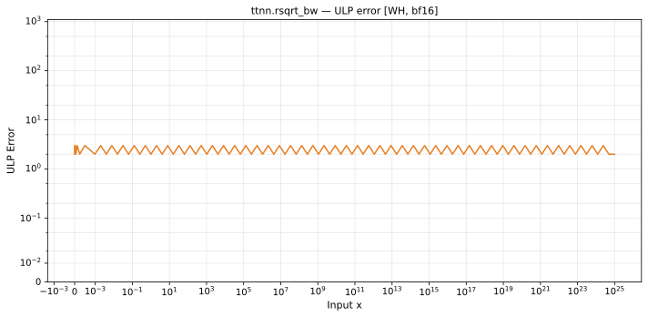

# rsqrt_bw — Wormhole (WH), bfloat16
_This page is auto-generated by `ttnn-accuracy report`. Do not edit manually._

**Architecture:** Wormhole (WH)  
**Data type:** bfloat16  

---

[← Wormhole (WH) bfloat16 ops](README.md) | [All archs for rsqrt_bw](../../../by_op/rsqrt_bw/README.md) | [Top](../../../README.md)

**Measured input range:** x ∈ [1.303e-26, 1.216e+25]  

|  | `default` |
|---|---|
| Max ULP | 3.23 |
| Min ULP | 0 |
| Mean ULP | 1.19 |
| Signed bias (ULP) | -0.137 |
| p50 ULP | 0.763 |
| p95 ULP | 1.91 |
| p99 ULP | 2.54 |
| Exact fraction | 0.332 |
| Correctly rounded | 0.332 |
| Accurate to \|x\| | nowhere |
| Max abs error | 1.56e+36 |
| Max rel error | 0.0146 |
| Median rel error | 0.0064 |
| Bits of precision (worst) | 6.09 |
| Bits of precision (median) | 7.29 |

**default** — 75 of 21665 points returned inf or zero where a value exists; the rest reach 3.23 ULP  

**Outcomes**

| Parameters | exact | faithful | inexact | mismatch | zeroed |
|---|---|---|---|---|---|
| `default` | 7,171 | 5,649 | 8,770 | 74 | 1 |

**Worst points**

| Parameters | x | golden | device | ULP |
|---|---|---|---|---|
| `default` | 3.5946814e-26 | -7.3439847e+37 | -7.443677e+37 | 3.23 |
| `default` | 1.4378725e-25 | -9.179981e+36 | -9.304596e+36 | 3.23 |
| `default` | 5.75149e-25 | -1.1474976e+36 | -1.1630745e+36 | 3.23 |
| `default` | 2.300596e-24 | -1.434372e+35 | -1.4538431e+35 | 3.23 |
| `default` | 9.202384e-24 | -1.792965e+34 | -1.8173039e+34 | 3.23 |
| `default` | 3.6809537e-23 | -2.2412063e+33 | -2.2716299e+33 | 3.23 |
| `default` | 1.4723815e-22 | -2.8015078e+32 | -2.8395373e+32 | 3.23 |
| `default` | 5.889526e-22 | -3.5018848e+31 | -3.5494217e+31 | 3.23 |
| `default` | 2.3558104e-21 | -4.377356e+30 | -4.436777e+30 | 3.23 |
| `default` | 9.4232415e-21 | -5.471695e+29 | -5.5459714e+29 | 3.23 |

**Monotonicity**

_Checked only where the reference is itself ordered, and never across a discontinuity._

| Parameters | Pairs | Violations | Rate | Worst \|Δy\| |
|---|---|---|---|---|
| `default` | 21,589 | 0 | 0 | 0 |

**Non-finite outputs**

| Parameters | Points | Both | Device only | Golden only | Device inf | Device nan | Golden inf | Golden nan |
|---|---|---|---|---|---|---|---|---|
| `default` | 74 | 0 | 74 | 0 | 74 | 0 | 0 | 0 |

| Parameters | x | golden | device |
|---|---|---|---|
| `default` | 1.3025671e-26 | -3.3629468e+38 | -inf |
| `default` | 1.3126645e-26 | -3.32307e+38 | -inf |
| `default` | 1.322762e-26 | -3.2831931e+38 | -inf |
| `default` | 1.3328594e-26 | -3.2433163e+38 | -inf |
| `default` | 1.3429568e-26 | -3.2167317e+38 | -inf |
| `default` | 1.3530542e-26 | -3.176855e+38 | -inf |
| `default` | 1.3631516e-26 | -3.136978e+38 | -inf |
| `default` | 1.373249e-26 | -3.1103935e+38 | -inf |
| `default` | 1.3833465e-26 | -3.0705167e+38 | -inf |
| `default` | 1.3934439e-26 | -3.0439321e+38 | -inf |

### Special values

| Variant | x | device | golden |  |
|---|---|---|---|---|
| `default` | 0 | inf | -inf | **differ** |
| `default` | -0 | inf | inf | agree |
| `default` | inf | 0 | -0 | **differ** |
| `default` | -inf | inf | nan | **differ** |
| `default` | nan | inf | nan | **differ** |
| `default` | 1.1754944e-38 | -inf | -inf | agree |
| `default` | -1.1754944e-38 | inf | nan | **differ** |

> **Provenance unknown.** These figures predate run tracking. Re-measure to attribute them.

