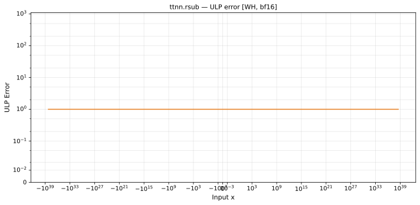

# rsub — Wormhole (WH), bfloat16
_This page is auto-generated by `ttnn-accuracy report`. Do not edit manually._

**Architecture:** Wormhole (WH)  
**Data type:** bfloat16  

---

[← Wormhole (WH) bfloat16 ops](README.md) | [All archs for rsub](../../../by_op/rsub/README.md) | [Top](../../../README.md)

**Measured input range:** all normal values  

| Parameters | Max ULP | Mean ULP | Max abs error |
|------------|---------|----------|---------------|
| `default` | 1 | 1 | 1.33e+36 |

**default** — within 2 ULP everywhere  

**Outcomes**

| Parameters | inexact | overflow |
|------------|------|------|
| `default` | 65,024 | 2 |

> **Provenance unknown.** These figures predate run tracking. Re-measure to attribute them.

