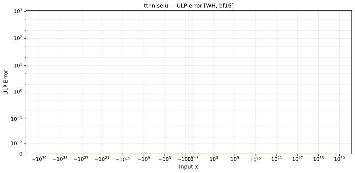

# selu — Wormhole (WH), bfloat16
_This page is auto-generated by `scripts/generate_reports.py`. Do not edit manually._

_Generated: 2026-04-28 08:41 UTC_

**Operation:** `selu`  
**Architecture:** Wormhole (WH)  
**Data type:** bfloat16  

---

[← Wormhole (WH) bfloat16 ops](README.md) | [All archs for selu](../../../by_op/selu/README.md) | [Top](../../../README.md)

## Variant: `default`

| Metric | Value |
|--------|-------|
| Max ULP error (display range) | 3.04e+35 ⚠ (14738 groups > 1000 ULP, see max abs error) |
| Mean ULP error (display range) | 1.04e+34 |
| Max absolute error | 0.0311 |

