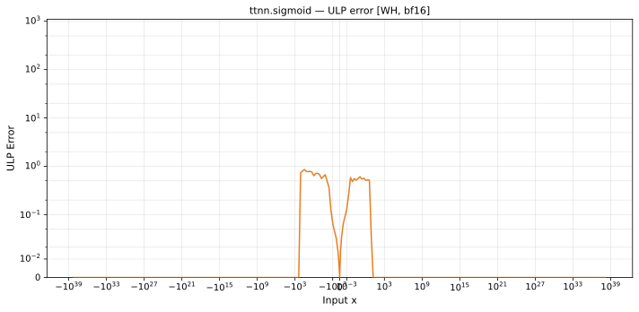

# sigmoid — Wormhole (WH), bfloat16
_This page is auto-generated by `ttnn-accuracy report`. Do not edit manually._

_Generated: 2026-09-03 10:37_

**Architecture:** Wormhole (WH)  
**Data type:** bfloat16  

---

[← Wormhole (WH) bfloat16 ops](README.md) | [All archs for sigmoid](../../../by_op/sigmoid/README.md) | [Top](../../../README.md)

**Measured input range:** x ∈ [-3.39e+38, 3.39e+38]  

| Parameters | Max ULP | Mean ULP | Accurate to \|x\| | Max abs error |
|---|---|---|---|---------------|
| `default` | 1 | 0.876 | 3.39e+38 | 0.00391 |

**default** — within 2 ULP everywhere  

**Outcomes**

| Parameters | exact | flushed | inexact |
|------------|------|------|------|
| `default` | 64,132 | 387 | 505 |

### Special values

| Variant | x | device | golden | |
|---|---|---|---|---|
| `default` | 0 | 0.5 | 0.5 | agree |
| `default` | -0 | 0.5 | 0.5 | agree |
| `default` | inf | 1 | 1 | agree |
| `default` | -inf | 0 | 0 | agree |
| `default` | nan | 1 | nan | **differ** |
| `default` | 1.175e-38 | 0.5 | 0.5 | agree |
| `default` | -1.175e-38 | 0.5 | 0.5 | agree |

_Measured on WORMHOLE_B0 · tt-metal `812427269cb` · ttnn `0.1.dev30578+g5b8d933` · run `20260902T135808`_

