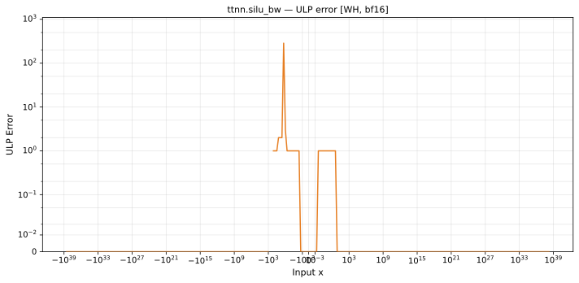

# silu_bw — Wormhole (WH), bfloat16
_This page is auto-generated by `ttnn-accuracy report`. Do not edit manually._

**Architecture:** Wormhole (WH)  
**Data type:** bfloat16  

---

[← Wormhole (WH) bfloat16 ops](README.md) | [All archs for silu_bw](../../../by_op/silu_bw/README.md) | [Top](../../../README.md)

**Measured input range:** x ∈ [-3.39e+38, 3.39e+38]  

|  | `default` |
|---|---|
| Max ULP | 285 |
| Min ULP | 0 |
| Mean ULP | 1.31 |
| Signed bias (ULP) | 0.385 |
| p50 ULP | 0 |
| p95 ULP | 0.123 |
| p99 ULP | 0.742 |
| Exact fraction | 0.979 |
| Correctly rounded | 0.979 |
| Accurate to \|x\| | 0.867 |
| Max abs error | 0.0113 |
| Max rel error | 1.8 |
| Median rel error | 0.00454 |
| Bits of precision (worst) | -0.846 |
| Bits of precision (median) | 7.78 |

**default** — 9 of 65024 points returned inf or zero where a value exists  

**Outcomes**

| Parameters | exact | faithful | flushed | inexact | zeroed |
|---|---|---|---|---|---|
| `default` | 63,278 | 1,102 | 378 | 257 | 9 |

**Worst points**

| Parameters | x | golden | device | ULP |
|---|---|---|---|---|
| `default` | -1.28125 | -0.00060653687 | -0.0016937256 | 285 |
| `default` | -1.2890625 | -0.0022888184 | -0.0033721924 | 70.8 |
| `default` | -1.2578125 | 0.004547119 | 0.0034484863 | 36.5 |
| `default` | -1.3125 | -0.007232666 | -0.008300781 | 34.6 |
| `default` | -1.3046875 | -0.0056152344 | -0.006652832 | 34.1 |
| `default` | -1.2734375 | 0.0010986328 | 0.0008544922 | 32 |
| `default` | -1.296875 | -0.003967285 | -0.0033569336 | 19.8 |
| `default` | -1.265625 | 0.002822876 | 0.0025787354 | 15.9 |
| `default` | -1.3359375 | -0.012023926 | -0.013000488 | 15.8 |
| `default` | -1.328125 | -0.010437012 | -0.011413574 | 15.7 |

### Special values

| Variant | x | device | golden |  |
|---|---|---|---|---|
| `default` | 0 | 0.5 | 0.5 | agree |
| `default` | -0 | 0.5 | 0.5 | agree |
| `default` | inf | 1 | nan | **differ** |
| `default` | -inf | 0 | nan | **differ** |
| `default` | nan | 1 | nan | **differ** |
| `default` | 1.1754944e-38 | 0.5 | 0.5 | agree |
| `default` | -1.1754944e-38 | 0.5 | 0.5 | agree |

> **Provenance unknown.** These figures predate run tracking. Re-measure to attribute them.

