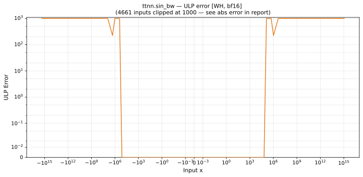

# sin_bw — Wormhole (WH), bfloat16
_This page is auto-generated by `ttnn-accuracy report`. Do not edit manually._

**Architecture:** Wormhole (WH)  
**Data type:** bfloat16  

---

[← Wormhole (WH) bfloat16 ops](README.md) | [All archs for sin_bw](../../../by_op/sin_bw/README.md) | [Top](../../../README.md)

**Measured input range:** x ∈ [-3.39e+38, 3.39e+38]  

| Parameters | Max ULP | Mean ULP | Accurate to \|x\| | Max abs error |
|---|---|---|---|---------------|
| `default` | 2.96e+38 ⚠ | 2.71e+36 | 1.31e+05 | 3.34e+38 |

**default** — 21274 of 65024 points returned inf or zero where a value exists  

**Outcomes**

| Parameters | exact | inexact | mismatch |
|------------|------|------|------|
| `default` | 36,761 | 6,989 | 21,274 |

### Special values

| Variant | x | device | golden | |
|---|---|---|---|---|
| `default` | 0 | 1 | 1 | agree |
| `default` | -0 | 1 | 1 | agree |
| `default` | inf | -inf | nan | **differ** |
| `default` | -inf | inf | nan | **differ** |
| `default` | nan | -inf | nan | **differ** |
| `default` | 1.175e-38 | 1 | 1 | agree |
| `default` | -1.175e-38 | 1 | 1 | agree |

_Measured on WORMHOLE_B0 · tt-metal `f6deef232f7` · ttnn `0.1.dev30578+g5b8d933` · run `20260904T120341`_

