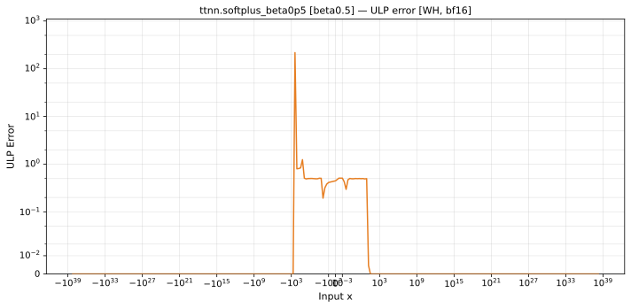
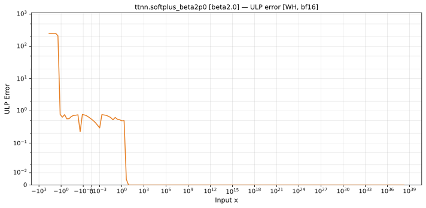

# softplus — Wormhole (WH), bfloat16
_This page is auto-generated by `scripts/generate_reports.py`. Do not edit manually._

_Generated: 2026-05-26 22:04 UTC_

**Architecture:** Wormhole (WH)  
**Data type:** bfloat16  

---

[← Wormhole (WH) bfloat16 ops](README.md) | [All archs for softplus](../../../by_op/softplus/README.md) | [Top](../../../README.md)

**Measured input range:** all normal values  

| Parameters | Max ULP | Mean ULP | Max abs error |
|------------|---------|----------|---------------|
| `beta=0.5` | 217 | 0.225 | 0.0311 |
| `beta=1.0` | 1.24 | 0.218 | 0.0155 |
| `beta=2.0` | 1.24 | 0.216 | 0.00777 |

### `beta=0.5`

### `beta=1.0`

### `beta=2.0`

