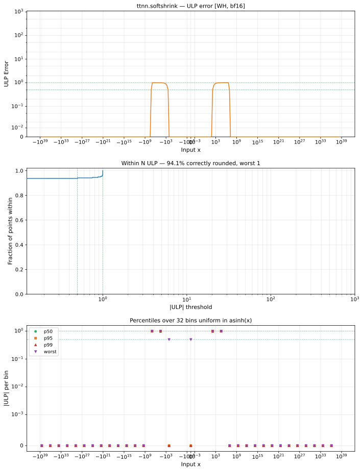

# softshrink — Wormhole (WH), bfloat16
_This page is auto-generated by `ttnn-accuracy report`. Do not edit manually._

**Architecture:** Wormhole (WH)  
**Data type:** bfloat16  

---

[← Wormhole (WH) bfloat16 ops](README.md) | [All archs for softshrink](../../../by_op/softshrink/README.md) | [Top](../../../README.md)

**Measured input range:** x ∈ [-3.39e+38, 3.39e+38]  

|  | `default` |
|---|---|
| Max ULP | 1 |
| Min ULP | 0 |
| Mean ULP | 0.948 |
| Signed bias (ULP) | 0 |
| p50 ULP | 0 |
| p95 ULP | 0.938 |
| p99 ULP | 1 |
| Exact fraction | 0.939 |
| Correctly rounded | 0.941 |
| Accurate to \|x\| | 3.39e+38 |
| Max abs error | 3.28e+04 |
| Max rel error | 0.00775 |
| Median rel error | 0.00497 |
| Bits of precision (worst) | 7.01 |
| Bits of precision (median) | 7.65 |

**default** — faithful; 3968/65024 tie-breaks  

**Outcomes**

| Parameters | exact | faithful |
|---|---|---|
| `default` | 61,056 | 3,968 |

**Worst points**

| Parameters | x | golden | device | ULP |
|---|---|---|---|---|
| `default` | 4227072 | 4227072 | 4194304 | 1 |
| `default` | 4259840 | 4259840 | 4227072 | 1 |
| `default` | 4292608 | 4292608 | 4259840 | 1 |
| `default` | 4325376 | 4325376 | 4292608 | 1 |
| `default` | 4358144 | 4358144 | 4325376 | 1 |
| `default` | 4390912 | 4390912 | 4358144 | 1 |
| `default` | 4423680 | 4423680 | 4390912 | 1 |
| `default` | 4456448 | 4456448 | 4423680 | 1 |
| `default` | 4489216 | 4489216 | 4456448 | 1 |
| `default` | 4521984 | 4521984 | 4489216 | 1 |

**Monotonicity**

_Checked only where the reference is itself ordered, and never across a discontinuity._

| Parameters | Pairs | Violations | Rate | Worst \|Δy\| |
|---|---|---|---|---|
| `default` | 65,022 | 0 | 0 | 0 |

### Special values

| Variant | x | device | golden |  |
|---|---|---|---|---|
| `default` | 0 | 0 | 0 | agree |
| `default` | -0 | 0 | 0 | agree |
| `default` | inf | inf | inf | agree |
| `default` | -inf | -inf | -inf | agree |
| `default` | nan | inf | nan | **differ** |
| `default` | 1.1754944e-38 | 0 | 0 | agree |
| `default` | -1.1754944e-38 | 0 | 0 | agree |

> **Provenance unknown.** These figures predate run tracking. Re-measure to attribute them.

