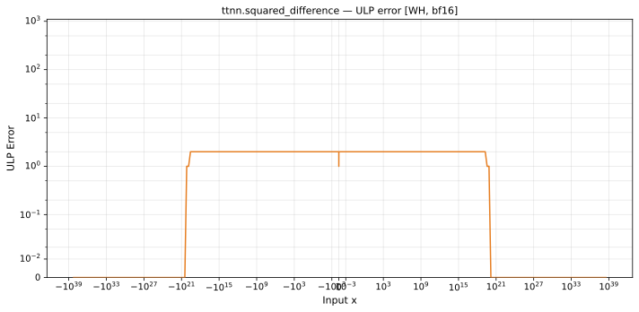

# squared_difference — Wormhole (WH), bfloat16
_This page is auto-generated by `ttnn-accuracy report`. Do not edit manually._

**Architecture:** Wormhole (WH)  
**Data type:** bfloat16  

---

[← Wormhole (WH) bfloat16 ops](README.md) | [All archs for squared_difference](../../../by_op/squared_difference/README.md) | [Top](../../../README.md)

**Measured input range:** all normal values  

|  | `default` |
|---|---|
| Max ULP | 2.03 |
| Min ULP | 0 |
| Mean ULP | 1.65 |
| Signed bias (ULP) | 1.64 |
| p50 ULP | 1.76 |
| p95 ULP | 2.03 |
| p99 ULP | 2.03 |
| Exact fraction | 0.243 |
| Correctly rounded | 0.571 |
| Max abs error | 2.26e+36 |
| Max rel error | 0.0125 |
| Median rel error | 0.00888 |
| Bits of precision (worst) | 6.32 |
| Bits of precision (median) | 6.82 |

**default** — worst sampled pairing  

**Outcomes**

| Parameters | exact | faithful | inexact | overflow |
|---|---|---|---|---|
| `default` | 15,810 | 13,348 | 35,866 | 2 |

**Worst points**

| Parameters | x | x2 | golden | device | ULP |
|---|---|---|---|---|---|
| `default` | 4.7645603e-22 | 1.4230154e-19 | 2.0111974e-38 | 1.9928303e-38 | 2.03 |
| `default` | 9.529121e-22 | 2.8460307e-19 | 8.0447895e-38 | 7.971321e-38 | 2.03 |
| `default` | 1.323489e-21 | 1.4314857e-19 | 2.0111974e-38 | 1.9928303e-38 | 2.03 |
| `default` | 1.9058241e-21 | 5.6920614e-19 | 3.2179158e-37 | 3.1885284e-37 | 2.03 |
| `default` | 2.170522e-21 | 1.439956e-19 | 2.0111974e-38 | 1.9928303e-38 | 2.03 |
| `default` | 2.646978e-21 | 2.8629714e-19 | 8.0447895e-38 | 7.971321e-38 | 2.03 |
| `default` | 3.0175549e-21 | 1.4484263e-19 | 2.0111974e-38 | 1.9928303e-38 | 2.03 |
| `default` | 3.8116483e-21 | 1.1384123e-18 | 1.2871663e-36 | 1.2754114e-36 | 2.03 |
| `default` | 3.864588e-21 | 1.4568967e-19 | 2.0111974e-38 | 1.9928303e-38 | 2.03 |
| `default` | 4.341044e-21 | 2.879912e-19 | 8.0447895e-38 | 7.971321e-38 | 2.03 |

**Non-finite outputs**

| Parameters | Points | Both | Device only | Golden only | Device inf | Device nan | Golden inf | Golden nan |
|---|---|---|---|---|---|---|---|---|
| `default` | 2 | 2 | 0 | 0 | 2 | 0 | 2 | 0 |

| Parameters | x | x2 | golden | device |
|---|---|---|---|---|
| `default` | inf | 0 | inf | inf |
| `default` | -inf | 0 | inf | inf |

### Special values

| Variant | x | device | golden |  |
|---|---|---|---|---|
| `default` | 0 | 1 | 1 | agree |
| `default` | -0 | 1 | 1 | agree |
| `default` | inf | inf | inf | agree |
| `default` | -inf | inf | inf | agree |
| `default` | nan | inf | nan | **differ** |
| `default` | 1.1754944e-38 | 1 | 1 | agree |
| `default` | -1.1754944e-38 | 1 | 1 | agree |

> **Provenance unknown.** These figures predate run tracking. Re-measure to attribute them.

