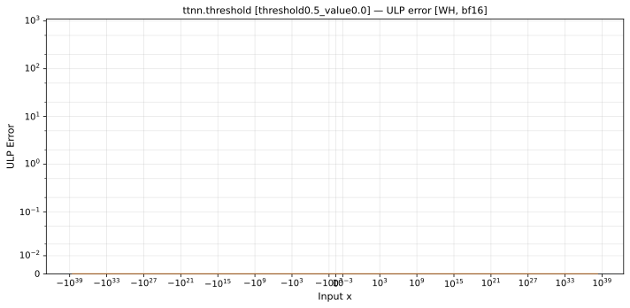

# threshold — Wormhole (WH), bfloat16
_This page is auto-generated by `ttnn-accuracy report`. Do not edit manually._

_Generated: 2026-08-31 09:14_

**Architecture:** Wormhole (WH)  
**Data type:** bfloat16  

---

[← Wormhole (WH) bfloat16 ops](README.md) | [All archs for threshold](../../../by_op/threshold/README.md) | [Top](../../../README.md)

**Measured input range:** x ∈ [-3.39e+38, 3.39e+38]  

| Parameters | Max ULP | Mean ULP | Accurate to \|x\| | Max abs error |
|---|---|---|---|---------------|
| `threshold=0.5,value=0.0` | 0 | — | 3.39e+38 | 0 |

**threshold=0.5,value=0.0** — bit-exact · _domain midpoint, torch's zero fill_  

**Outcomes**

| Parameters | exact |
|------------|------|
| `threshold=0.5,value=0.0` | 65,024 |

### Special values

| Variant | x | device | golden | |
|---|---|---|---|---|
| `threshold=0.5,value=0.0` | 0 | 0 | 0 | agree |
| `threshold=0.5,value=0.0` | -0 | 0 | 0 | agree |
| `threshold=0.5,value=0.0` | inf | inf | inf | agree |
| `threshold=0.5,value=0.0` | -inf | 0 | 0 | agree |
| `threshold=0.5,value=0.0` | nan | inf | nan | **differ** |
| `threshold=0.5,value=0.0` | 1.175e-38 | 0 | 0 | agree |
| `threshold=0.5,value=0.0` | -1.175e-38 | 0 | 0 | agree |

_Measured on WORMHOLE_B0 · tt-metal `2adf8c65887` · ttnn `0.75.0rc10.dev817+g2adf8c65887` · run `20260831T073412`_

