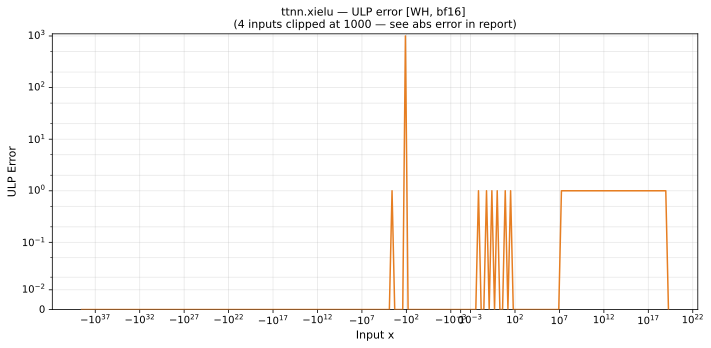

# xielu — Wormhole (WH), bfloat16
_This page is auto-generated by `ttnn-accuracy report`. Do not edit manually._

**Architecture:** Wormhole (WH)  
**Data type:** bfloat16  

---

[← Wormhole (WH) bfloat16 ops](README.md) | [All archs for xielu](../../../by_op/xielu/README.md) | [Top](../../../README.md)

**Measured input range:** x ∈ [-3.39e+38, 2.046e+19]  

|  | `default` |
|---|---|
| Max ULP | 0.5 |
| Min ULP | 0 |
| Mean ULP | 0.5 |
| Signed bias (ULP) | -0.5 |
| p50 ULP | 0.2 |
| p95 ULP | 0.4 |
| p99 ULP | 0.489 |
| Exact fraction | 0.999 |
| Correctly rounded | 1 |
| Accurate to \|x\| | 2.33e-38 |
| Max abs error | 6.6e+35 |
| Max rel error | 0.00386 |
| Median rel error | 0.00247 |
| Bits of precision (worst) | 8.02 |
| Bits of precision (median) | 8.66 |

**default** — 1/56847 defects; rest 0.5 ULP  

**Outcomes**

| Parameters | exact | faithful | flushed | zeroed |
|---|---|---|---|---|
| `default` | 56,669 | 50 | 127 | 1 |

**Worst points**

| Parameters | x | golden | device | ULP |
|---|---|---|---|---|
| `default` | 0.009765625 | 0.0049438477 | 0.0049743652 | 0.5 |
| `default` | 0.1171875 | 0.06933594 | 0.06982422 | 0.5 |
| `default` | 0.390625 | 0.31640625 | 0.31835938 | 0.5 |
| `default` | 1.09375 | 1.5 | 1.5078125 | 0.5 |
| `default` | 2.1875 | 4.9375 | 4.9375 | 0.5 |
| `default` | 2.8125 | 7.75 | 7.75 | 0.5 |
| `default` | 6.25 | 34.5 | 34.5 | 0.5 |
| `default` | 8.125 | 57 | 57 | 0.5 |
| `default` | 11.875 | 119 | 119 | 0.5 |
| `default` | 14.375 | 172 | 173 | 0.5 |

**Monotonicity**

_Checked only where the reference is itself ordered, and never across a discontinuity._

| Parameters | Pairs | Violations | Rate | Worst \|Δy\| |
|---|---|---|---|---|
| `default` | 24,206 | 0 | 0 | 0 |

### Special values

| Variant | x | device | golden |  |
|---|---|---|---|---|
| `default` | 0 | -8.009374e-07 | -8.009374e-07 | agree |
| `default` | -0 | -8.009374e-07 | -8.009374e-07 | agree |
| `default` | inf | inf | inf | agree |
| `default` | -inf | inf | nan | **differ** |
| `default` | nan | inf | nan | **differ** |
| `default` | 1.1754944e-38 | 0 | 5.877472e-39 | **differ** |
| `default` | -1.1754944e-38 | -8.009374e-07 | -8.009374e-07 | agree |

> **Provenance unknown.** These figures predate run tracking. Re-measure to attribute them.

