# Wormhole (WH) — float32
_This page is auto-generated by `ttnn-accuracy report`. Do not edit manually._

[← Wormhole (WH)](../README.md) | [Top](../../../README.md)

## Operations Summary

_Accurate to \|x\|: the largest \|x\| within 2 ULP. `n/a` for ops of more than one operand, where a bound on x would describe its sampled partner instead._

| Op | Parameters | Max ULP | Mean ULP | Accurate to \|x\| | Max abs error | µs |
|----|------------|---------|----------|-----------------|---------------|----|
| [abs](abs.md) | `default` | 0 | — | 3.39e+38 | 0 | 774 |
| [abs_bw](abs_bw.md) | `default` | 0 | — | 3.39e+38 | 0 | 2483 |
| [acos](acos.md) | `default` | 2 | 1 | 1 | 2.38e-07 | 1073 |
| [acos_bw](acos_bw.md) | `default` | 609 | 1.61 | 0.938 | 0.00232 | 14942 |
| [acosh](acosh.md) | `default` | 3 | 1 | nowhere | 7.63e-06 | 1431 ±8% |
| [acosh_bw](acosh_bw.md) | `default` | 724 | 1.12 | 0.996 | 0.00276 | 17134 |
| [add](add.md) | `default` | 0 | — | n/a | 0 | 982 |
| [add_](add_.md) | `default` | 0 | — | n/a | 0 | 997 |
| [addalpha](addalpha.md) | `alpha=2.0` | 0 | — | n/a | 0 | 988 |
| [addcdiv](addcdiv.md) | `default` | 2.19e+12 ⚠ | 8.82e+07 | n/a | 2.03e+31 | 1333 ±141% |
| [addcmul](addcmul.md) | `default` | 2.13e+06 ⚠ | 1.59e+04 | n/a | 1.01e+31 | 1328 |
| [asin](asin.md) | `default` | 2 | 1.08 | 1 | 1.19e-07 | 1049 |
| [asin_bw](asin_bw.md) | `default` | 609 | 1.61 | 0.938 | 0.00232 | 14717 |
| [asinh](asinh.md) | `default` | 2 | 1 | 3.39e+38 | 7.63e-06 | 1795 |
| [asinh_bw](asinh_bw.md) | `default` | 2 | 1.03 | 1.84e+19 | 1.19e-07 | 2598 |
| [atan](atan.md) | `default` | 2 | 1.02 | 3.39e+38 | 1.19e-07 | 908 |
| [atan2](atan2.md) | `default` | 1.32e+07 ⚠ | 1.26e+05 | n/a | 0.785 | 1029 |
| [atan2_bw](atan2_bw.md) | `default` | 1.64e+07 ⚠ | 9.5e+04 | n/a | 4.5e+18 | 10585 |
| [atan_bw](atan_bw.md) | `default` | 3 | 1.19 | 4.08e+03 | 1.19e-07 | 2563 |
| [atanh](atanh.md) | `default` | 3 | 1.56 | 0.000852 | 2.38e-07 | 1353 ±6% |
| [atanh_bw](atanh_bw.md) | `default` | 2.05e+03 ⚠ | 1.51 | 0.852 | 0.25 | 16372 |
| [bias_gelu](bias_gelu.md) | `default` | 2.91e+38 ⚠ | 4.94e+36 | n/a | 0.0234 | 990 ±8% |
| [bias_gelu_](bias_gelu_.md) | `default` | 2.91e+38 ⚠ | 4.94e+36 | n/a | 0.0234 | 993 |
| [cbrt](cbrt.md) | `default` | 3 | 1.82 | 5.77e-38 | 1.05e+06 | 844 ±6% |
| [ceil](ceil.md) | `default` | 0 | — | 3.39e+38 | 0 | 770 |
| [celu](celu.md) | `default` | 1 | 1 | 3.39e+38 | 5.96e-08 | 940 |
| [celu_bw](celu_bw.md) | `default` | 1 | 1 | 3.39e+38 | 5.96e-08 | 5439 |
| [clamp](clamp.md) | `min=-1.0,max=1.0` | 0 | — | 3.39e+38 | 0 | 773 |
|  | `min=0.0,max=0.0` | 0 | — | 3.39e+38 | 0 | 773 |
|  | `min=1.0,max=-1.0` | 0 | — | 3.39e+38 | 0 | 772 |
| [clamp_bw](clamp_bw.md) | `default` | 0 | — | n/a | 0 | 4619 |
| [clip](clip.md) | `min=-1.0,max=1.0` | 0 | — | 3.39e+38 | 0 | 781 ±12% |
|  | `min=0.0,max=0.0` | 0 | — | 3.39e+38 | 0 | 767 |
|  | `min=1.0,max=-1.0` | 0 | — | 3.39e+38 | 0 | 768 |
| [clip_bw](clip_bw.md) | `default` | 0 | — | n/a | 0 | 4623 |
| [cos](cos.md) | `default` | 3.21e+38 ⚠ | 1.45e+36 | 5.23e+04 | 3.4e+38 | 859 |
| [cos_bw](cos_bw.md) | `default` | 3.32e+38 ⚠ | 1.86e+36 | 1.04e+05 | 3.4e+38 | 3306 |
| [cosh](cosh.md) | `default` | 1 | 1 | 89 | 2.03e+31 | 979 |
| [cosh_bw](cosh_bw.md) | `default` | 2 | 1.14 | 88.5 | 5.07e+30 | 13493 |
| [deg2rad](deg2rad.md) | `default` | 1 | 1 | 3.39e+38 | 6.34e+29 | 773 |
| [digamma](digamma.md) | `default` | 3.66e+17 ⚠ | 7.77e+12 | nowhere | 8.51e+37 | 2651 |
| [digamma_bw](digamma_bw.md) | `default` | 7.91e+33 ⚠ | 3.25e+29 | 8.58e-05 | 2.59e+38 | 18064 |
| [div](div.md) | `default` | 2 | 1.2 | n/a | 2.03e+31 | 1006 |
| [div_bw](div_bw.md) | `default` | 1 | 1 | n/a | 5.07e+30 | 20695 |
| [div_no_nan](div_no_nan.md) | `default` | 2 | 1.53 | n/a | 4.06e+31 | 3466 |
| [divide](divide.md) | `default` | 2 | 1.2 | n/a | 2.03e+31 | 1001 |
| [divide_](divide_.md) | `default` | 2 | 1.2 | n/a | 2.03e+31 | 1007 ±7% |
| [elu](elu.md) | `default` | 1 | 1 | 3.39e+38 | 5.96e-08 | 934 |
| [elu_bw](elu_bw.md) | `default` | 1 | 1 | 3.39e+38 | 5.96e-08 | 5430 |
| [eq](eq.md) | `default` | 0 | — | n/a | 0 | 983 |
| [eq_](eq_.md) | `default` | 0 | — | n/a | 0 | 1003 |
| [eqz](eqz.md) | `default` | 0 | — | 3.39e+38 | 0 | 770 |
| [erf](erf.md) | `default` | 6 | 1.22 | 0.000334 | 4.77e-07 | 1198 ±11% |
| [erf_bw](erf_bw.md) | `default` | 65 | 3.72 | 0.996 | 1.19e-07 | 4874 ±38% |
| [erfc](erfc.md) | `default` | 2.1e+33 ⚠ | 1.71e+29 | nowhere | 9.7e-05 | 1352 ±7% |
| [erfc_bw](erfc_bw.md) | `default` | 65 | 3.72 | 0.996 | 1.19e-07 | 4865 |
| [erfinv](erfinv.md) | `default` | 7.96e+06 ⚠ | 2.62e+05 | 1.32e-38 | 0.00522 | 1407 ±12% |
| [erfinv_bw](erfinv_bw.md) | `default` | 4.98e+05 ⚠ | 1.32e+03 | 0.000496 | 243 | 15403 |
| [exp](exp.md) | `default` | 1 | 1 | 3.39e+38 | 2.03e+31 | 896 |
|  | `fast_approx` | 3.79e+05 ⚠ | 2e+05 | nowhere | 6.16e+36 | 766 |
| [exp2](exp2.md) | `default` | 1 | 1 | 3.39e+38 | 2.03e+31 | 840 |
| [exp2_bw](exp2_bw.md) | `default` | 2 | 1.17 | 128 | 2.03e+31 | 3312 |
| [exp_bw](exp_bw.md) | `default` | 1 | 1 | 3.39e+38 | 2.03e+31 | 2603 |
| [expm1](expm1.md) | `default` | 1 | 1 | 3.39e+38 | 2.03e+31 | 1034 ±6% |
| [expm1_bw](expm1_bw.md) | `default` | 4.91e+06 ⚠ | 1.14e+04 | 2.08 | 2.03e+31 | 3496 ±56% |
| [floor](floor.md) | `default` | 0 | — | 3.39e+38 | 0 | 781 |
| [floor_div](floor_div.md) | `default` | 4.19e+06 ⚠ | 1.77e+03 | n/a | 1 | 4788 |
| [fmod](fmod.md) | `default` | 1.7e+38 ⚠ | 2.72e+36 | n/a | 2.03e+31 | 1022 |
| [frac](frac.md) | `default` | 0 | — | 3.39e+38 | 0 | 766 |
| [ge](ge.md) | `default` | 0 | — | n/a | 0 | 982 |
| [ge_](ge_.md) | `default` | 0 | — | n/a | 0 | 994 |
| [gelu](gelu.md) | `default` | 1.51e+08 ⚠ | 1.55e+05 | 0.309 | 2.86e-06 | 1390 ±6% |
|  | `fast_approx` | 2.91e+38 ⚠ | 4.9e+36 | 6e-36 | 0.0234 | 769 ±27% |
| [gelu_bw](gelu_bw.md) | `default` | 6.59e+08 ⚠ | 1.24e+05 | 0.0393 | 0.00751 | 2093 |
| [gez](gez.md) | `default` | 0 | — | 3.39e+38 | 0 | 769 ±5% |
| [gt](gt.md) | `default` | 0 | — | n/a | 0 | 990 |
| [gt_](gt_.md) | `default` | 0 | — | n/a | 0 | 1002 |
| [gtz](gtz.md) | `default` | 0 | — | 3.39e+38 | 0 | 765 ±6% |
| [hardmish](hardmish.md) | `default` | 0 | — | 3.39e+38 | 0 | 766 |
| [hardshrink](hardshrink.md) | `default` | 0 | — | 3.39e+38 | 0 | 776 ±7% |
| [hardshrink_bw](hardshrink_bw.md) | `default` | 0 | — | 3.39e+38 | 0 | 3239 |
| [hardsigmoid](hardsigmoid.md) | `default` | 4.89e+06 ⚠ | 1.25e+03 | 2.61 | 5.96e-08 | 777 |
| [hardsigmoid_bw](hardsigmoid_bw.md) | `default` | 0 | — | 3.39e+38 | 0 | 5045 |
| [hardswish](hardswish.md) | `default` | 7.34e+06 ⚠ | 1.41e+03 | 2.36 | 2.38e-07 | 828 |
| [hardswish_bw](hardswish_bw.md) | `default` | 1.41e+10 ⚠ | 6e+06 | 0.00179 | 0.5 | 7079 |
| [hardtanh](hardtanh.md) | `default` | 0 | — | 3.39e+38 | 0 | 776 |
| [hardtanh_bw](hardtanh_bw.md) | `default` | 0 | — | 3.39e+38 | 0 | 4258 |
| [heaviside](heaviside.md) | `value=0.0` | 0 | — | 3.39e+38 | 0 | 776 |
|  | `value=0.5` | 0 | — | 3.39e+38 | 0 | 773 |
|  | `value=1.0` | 0 | — | 3.39e+38 | 0 | 784 |
| [hypot](hypot.md) | `default` | 3.44e+06 ⚠ | 3.28e+04 | n/a | 1.1e+12 | 1020 |
| [hypot_bw](hypot_bw.md) | `default` | 4.86e+06 ⚠ | 4.48e+04 | n/a | 1 | 6371 |
| [i0](i0.md) | `default` | 1.68e+07 ⚠ | 2.19e+06 | 2.56 | 3.09e+38 | 888 |
| [i0_bw](i0_bw.md) | `default` | 1.56e+07 ⚠ | 4.11e+04 | 0.00774 | 2.96e+38 | 3453 |
| [identity](identity.md) | `default` | 0 | — | 3.39e+38 | 0 | 768 |
| [isclose](isclose.md) | `default` | 0 | — | n/a | 0 | 1002 |
| [isfinite](isfinite.md) | `default` | 0 | — | 3.39e+38 | 0 | 765 |
| [isinf](isinf.md) | `default` | 0 | — | 3.39e+38 | 0 | 773 |
| [isnan](isnan.md) | `default` | 0 | — | 3.39e+38 | 0 | 773 |
| [isneginf](isneginf.md) | `default` | 0 | — | 3.39e+38 | 0 | 779 ±8% |
| [isposinf](isposinf.md) | `default` | 0 | — | 3.39e+38 | 0 | 771 |
| [l1_loss](l1_loss.md) | `default` | 0 | — | n/a | 0 | 990 |
| [ldexp](ldexp.md) | `default` | 2 | 1.5 | n/a | 4.06e+31 | 1001 |
| [ldexp_](ldexp_.md) | `default` | 2 | 1.5 | n/a | 4.06e+31 | 1010 |
| [ldexp_bw](ldexp_bw.md) | `default` | 1 | 1 | n/a | 1.19e-07 | 5237 |
| [le](le.md) | `default` | 0 | — | n/a | 0 | 991 |
| [le_](le_.md) | `default` | 0 | — | n/a | 0 | 998 |
| [leaky_relu](leaky_relu.md) | `negative_slope=0.0` | 0 | — | 3.39e+38 | 0 | 779 ±9% |
|  | `negative_slope=0.01` | 1 | 1 | 3.39e+38 | 3.17e+29 | 772 |
|  | `negative_slope=1.0` | 0 | — | 3.39e+38 | 0 | 767 |
| [leaky_relu_bw](leaky_relu_bw.md) | `default` | 0 | — | 3.39e+38 | 0 | 3580 |
| [lerp](lerp.md) | `default` | 1.46e+08 ⚠ | 9.53e+04 | n/a | 2.03e+31 | 1322 |
| [lerp_bw](lerp_bw.md) | `default` | 0 | — | n/a | 0 | 5381 |
| [lez](lez.md) | `default` | 0 | — | 3.39e+38 | 0 | 777 |
| [lgamma](lgamma.md) | `default` | 3.27e+07 ⚠ | 2.98e+03 | 0.108 | 4.06e+31 | 3735 |
| [lgamma_bw](lgamma_bw.md) | `default` | 3.66e+17 ⚠ | 7.77e+12 | nowhere | 8.51e+37 | 4364 |
| [log](log.md) | `default` | 1 | 1 | 3.39e+38 | 7.63e-06 | 865 ±213% |
| [log10](log10.md) | `default` | 2 | 1.22 | 3.39e+38 | 3.81e-06 | 877 |
| [log10_bw](log10_bw.md) | `default` | 2 | 1.41 | 3.69e+37 | 5.07e+30 | 10258 |
| [log1p](log1p.md) | `default` | 1 | 1 | 3.39e+38 | 7.63e-06 | 898 |
| [log1p_bw](log1p_bw.md) | `default` | 2 | 1.03 | 8.51e+37 | 0.125 | 10259 |
| [log2](log2.md) | `default` | 2 | 1 | 3.39e+38 | 7.63e-06 | 874 |
| [log2_bw](log2_bw.md) | `default` | 2 | 1.33 | nowhere | 1.01e+31 | 10222 |
| [log_bw](log_bw.md) | `default` | 1 | 1 | 8.51e+37 | 5.07e+30 | 7763 |
| [log_sigmoid](log_sigmoid.md) | `default` | 4.4e+05 ⚠ | 1.82e+04 | nowhere | 0.0181 | 1070 |
| [log_sigmoid_bw](log_sigmoid_bw.md) | `default` | 3 | 1.25 | 1.09 | 1.19e-07 | 11496 |
| [logaddexp](logaddexp.md) | `default` | 5.23e+08 ⚠ | 7.28e+06 | n/a | 7.63e-06 | 1509 ±38% |
| [logaddexp2](logaddexp2.md) | `default` | 1.54e+09 ⚠ | 1.05e+07 | n/a | 7.63e-06 | 1294 |
| [logaddexp2_](logaddexp2_.md) | `default` | 1.54e+09 ⚠ | 1.05e+07 | n/a | 7.63e-06 | 1288 |
| [logaddexp2_bw](logaddexp2_bw.md) | `default` | 46 | 6.56 | n/a | 1.19e-07 | 11227 |
| [logaddexp_](logaddexp_.md) | `default` | 5.23e+08 ⚠ | 7.28e+06 | n/a | 7.63e-06 | 1496 |
| [logaddexp_bw](logaddexp_bw.md) | `default` | 66 | 8.57 | n/a | 1.19e-07 | 9406 |
| [logical_and](logical_and.md) | `default` | 0 | — | n/a | 0 | 1003 |
| [logical_and_](logical_and_.md) | `default` | 0 | — | n/a | 0 | 1016 |
| [logical_not](logical_not.md) | `default` | 0 | — | 3.39e+38 | 0 | 768 |
| [logical_not_](logical_not_.md) | `default` | 0 | — | 1 | 0 | 772 |
| [logical_or](logical_or.md) | `default` | 0 | — | n/a | 0 | 1003 ±13% |
| [logical_or_](logical_or_.md) | `default` | 0 | — | n/a | 0 | 1014 |
| [logical_xor_](logical_xor_.md) | `default` | 0 | — | n/a | 0 | 1022 |
| [logit](logit.md) | `default` | 4.19e+06 ⚠ | 261 | 0.332 | 7.63e-06 | 1047 |
| [logit_bw](logit_bw.md) | `default` | 2 | 1.06 | 0.998 | 5.07e+30 | 13846 |
| [logiteps_bw](logiteps_bw.md) | `default` | 2 | 1.06 | 0.998 | 5.07e+30 | 16426 |
| [lt](lt.md) | `default` | 0 | — | n/a | 0 | 998 |
| [lt_](lt_.md) | `default` | 0 | — | n/a | 0 | 996 |
| [ltz](ltz.md) | `default` | 0 | — | 3.39e+38 | 0 | 766 |
| [mac](mac.md) | `default` | 8.33e+06 ⚠ | 1.45e+06 | n/a | 5.07e+30 | 1951 |
| [max_bw](max_bw.md) | `default` | 4.19e+06 ⚠ | 4.19e+06 | n/a | 0.5 | 10463 |
| [maximum](maximum.md) | `default` | 0 | — | n/a | 0 | 989 |
| [min_bw](min_bw.md) | `default` | 4.19e+06 ⚠ | 4.19e+06 | n/a | 0.5 | 10462 |
| [minimum](minimum.md) | `default` | 0 | — | n/a | 0 | 989 |
| [mish](mish.md) | `default` | 7 | 2.49 | 8.61e-06 | 1.91e-06 | 1176 ±8% |
| [mse_loss](mse_loss.md) | `default` | 2 | 1.94 | n/a | 2.03e+31 | 989 |
| [mul_bw](mul_bw.md) | `default` | 0 | — | n/a | 0 | 2692 |
| [multigammaln](multigammaln.md) | `default` | 3.51e+07 ⚠ | 9.16e+03 | 5.59e-17 | 4.06e+31 | 20737 |
| [multigammaln_bw](multigammaln_bw.md) | `default` | 1.36e+15 ⚠ | 2.04e+11 | 5.55e-17 | 2.36e+16 | 20237 |
| [multiply](multiply.md) | `default` | 0 | — | n/a | 0 | 983 |
| [multiply_](multiply_.md) | `default` | 0 | — | n/a | 0 | 998 |
| [ne](ne.md) | `default` | 0 | — | n/a | 0 | 1002 |
| [ne_](ne_.md) | `default` | 0 | — | n/a | 0 | 1001 |
| [neg](neg.md) | `default` | 0 | — | 3.39e+38 | 0 | 765 ±6% |
| [nextafter](nextafter.md) | `default` | 8.51e+37 ⚠ | 1.34e+36 | n/a | 1.19e-07 | 6082 |
| [nez](nez.md) | `default` | 0 | — | 3.39e+38 | 0 | 765 |
| [polygamma](polygamma.md) | `k=1` | 7.91e+33 ⚠ | 4.68e+29 | 8.58e-05 | 2.59e+38 | 6014 |
|  | `k=2` | 4.45e+30 ⚠ | 4.42e+26 | 1.79e-13 | 2.99e+38 | 6205 |
|  | `k=4` | 3.77e+25 ⚠ | 6.51e+21 | 3.68e-08 | 3.32e+38 | 6661 |
| [polygamma_bw](polygamma_bw.md) | `n=1` | 4.45e+30 ⚠ | 4.42e+26 | 1.79e-13 | 2.99e+38 | 18131 |
| [pow](pow.md) | `default` | 5.92e+03 ⚠ | 3.21 | n/a | 3e+34 | 2098 |
| [pow_bw](pow_bw.md) | `exponent=2.0` | 0 | — | 1.69e+38 | 0 | 4955 |
| [prelu](prelu.md) | `weight=0.25` | 0 | — | 3.39e+38 | 0 | 768 |
| [rad2deg](rad2deg.md) | `default` | 1 | 1 | 5.9e+36 | 2.03e+31 | 769 |
| [rdiv](rdiv.md) | `value=2.0` | 1 | 1 | 8.51e+37 | 1.01e+31 | 801 |
| [rdiv_bw](rdiv_bw.md) | `scalar=2.0` | 2 | 1.14 | 7.67e-20 | 2.03e+31 | 13337 |
| [reciprocal](reciprocal.md) | `default` | 1 | 1 | 8.51e+37 | 5.07e+30 | 788 |
| [reciprocal_bw](reciprocal_bw.md) | `default` | 2 | 1.14 | 5.42e-20 | 1.01e+31 | 10013 ±37% |
| [relu](relu.md) | `default` | 0 | — | 3.39e+38 | 0 | 764 |
| [relu6](relu6.md) | `default` | 0 | — | 3.39e+38 | 0 | 773 |
| [relu6_bw](relu6_bw.md) | `default` | 0 | — | 3.39e+38 | 0 | 7863 |
| [relu_bw](relu_bw.md) | `default` | 0 | — | 3.39e+38 | 0 | 2476 |
| [relu_max](relu_max.md) | `upper_limit=0.0` | 0 | — | 3.39e+38 | 0 | 766 |
|  | `upper_limit=1.0` | 0 | — | 3.39e+38 | 0 | 767 |
|  | `upper_limit=6.0` | 0 | — | 3.39e+38 | 0 | 768 |
| [relu_min](relu_min.md) | `lower_limit=0.0` | 0 | — | 3.39e+38 | 0 | 766 |
|  | `lower_limit=1.0` | 0 | — | 3.39e+38 | 0 | 766 |
| [remainder](remainder.md) | `default` | 1.7e+38 ⚠ | 2.68e+36 | n/a | 2.03e+31 | 1039 |
| [round](round.md) | `default` | 0 | — | 3.39e+38 | 0 | 771 |
| [rpow](rpow.md) | `exponent=0.5` | 1 | 1 | 3.39e+38 | 2.03e+31 | 1814 |
|  | `exponent=1.0` | 0 | — | 8.28e+34 | 0 | 1813 |
|  | `exponent=2.0` | 1 | 1 | 8.28e+34 | 2.03e+31 | 1799 |
| [rpow_bw](rpow_bw.md) | `exponent=2.0` | 0 | — | 1.18e-38 | 0 | 5695 |
| [rsqrt](rsqrt.md) | `default` | 1 | 1 | 3.39e+38 | 5.5e+11 | 844 |
| [rsqrt_bw](rsqrt_bw.md) | `default` | 7 | 4.51 | nowhere | 7.1e+31 | 11833 |
| [rsub](rsub.md) | `default` | 0 | — | n/a | 0 | 978 |
| [rsub_](rsub_.md) | `default` | 0 | — | n/a | 0 | 1008 |
| [selu](selu.md) | `default` | 51 | 26.2 | nowhere | 3.45e+32 | 968 |
| [selu_bw](selu_bw.md) | `default` | 51 | 20.6 | nowhere | 5.25e-06 | 6170 |
| [sigmoid](sigmoid.md) | `default` | 3 | 1.41 | 16.6 | 1.19e-07 | 1070 ±119% |
| [sigmoid_accurate](sigmoid_accurate.md) | `default` | 3 | 1.41 | 16.6 | 1.19e-07 | 1056 |
| [sigmoid_bw](sigmoid_bw.md) | `default` | 8.39e+06 ⚠ | 2.71e+04 | 0.859 | 1.12e-07 | 4491 |
| [sign](sign.md) | `default` | 0 | — | 3.39e+38 | 0 | 775 |
| [signbit](signbit.md) | `default` | 0 | — | 3.39e+38 | 0 | 764 |
| [silu](silu.md) | `default` | 3 | 1.58 | 0.000928 | 1.91e-06 | 1092 |
| [silu_bw](silu_bw.md) | `default` | 5.72e+06 ⚠ | 841 | 0.000244 | 9.54e-07 | 6223 |
| [sin](sin.md) | `default` | 3.32e+38 ⚠ | 1.86e+36 | 1.04e+05 | 3.4e+38 | 833 |
| [sin_bw](sin_bw.md) | `default` | 3.21e+38 ⚠ | 1.45e+36 | 5.23e+04 | 3.4e+38 | 2565 |
| [sinh](sinh.md) | `default` | 2 | 1.14 | 89 | 2.03e+31 | 1092 |
| [sinh_bw](sinh_bw.md) | `default` | 1 | 1 | 88.5 | 5.07e+30 | 11883 |
| [softplus](softplus.md) | `default` | 8.2e+03 ⚠ | 656 | nowhere | 6.93e+35 | 1416 ±9% |
| [softplus_bw](softplus_bw.md) | `default` | 3 | 1.37 | 1.1 | 1.79e-07 | 8669 |
| [softshrink](softshrink.md) | `default` | 0 | — | 3.39e+38 | 0 | 772 |
| [softshrink_bw](softshrink_bw.md) | `default` | 0 | — | 3.39e+38 | 0 | 4256 |
| [softsign](softsign.md) | `default` | 3 | 0.89 | 2.53e+07 | 1 | 812 |
| [softsign_bw](softsign_bw.md) | `default` | 8.38e+06 ⚠ | 1.54e+05 | 9.88e-05 | 2.38e-07 | 2580 |
| [sqrt](sqrt.md) | `default` | 1 | 1 | 3.39e+38 | 1.1e+12 | 829 |
| [sqrt_bw](sqrt_bw.md) | `default` | 2 | 1.41 | 3.39e+38 | 5.5e+11 | 12662 |
| [square](square.md) | `default` | 0 | — | 1.84e+19 | 0 | 769 |
| [square_bw](square_bw.md) | `default` | 0 | — | 1.69e+38 | 0 | 2498 |
| [squared_difference](squared_difference.md) | `default` | 2 | 1.94 | n/a | 2.03e+31 | 990 |
| [squared_difference_](squared_difference_.md) | `default` | 2 | 1.94 | n/a | 2.03e+31 | 1000 |
| [squared_difference_bw](squared_difference_bw.md) | `default` | 0 | — | n/a | 0 | 4218 |
| [subalpha](subalpha.md) | `alpha=2.0` | 0 | — | n/a | 0 | 995 ±277% |
| [subtract](subtract.md) | `default` | 0 | — | n/a | 0 | 989 |
| [subtract_](subtract_.md) | `default` | 0 | — | n/a | 0 | 995 |
| [swish](swish.md) | `default` | 3 | 1.58 | 0.000928 | 1.91e-06 | 1076 |
| [tan](tan.md) | `default` | 3.34e+38 ⚠ | 1.43e+36 | 20.3 | 3.4e+38 | 1155 ±9% |
| [tan_bw](tan_bw.md) | `default` | 3.16e+38 ⚠ | 9.23e+35 | 1.03 | 3.4e+38 | 4374 |
| [tanh](tanh.md) | `default` | 3 | 1.55 | 0.000485 | 1.19e-07 | 927 |
| [tanh_bw](tanh_bw.md) | `default` | 4.19e+06 ⚠ | 9.01e+03 | nowhere | 0.000814 | 1773 |
| [tanhshrink](tanhshrink.md) | `default` | 4.19e+06 ⚠ | 9.11e+04 | 1.34e-08 | 2 | 1415 ±6% |
| [tanhshrink_bw](tanhshrink_bw.md) | `default` | 4.19e+06 ⚠ | 9.85e+04 | 7.42e-09 | 2.38e-07 | 3395 |
| [threshold](threshold.md) | `threshold=0.0,value=1.0` | 0 | — | 3.39e+38 | 0 | 771 |
|  | `threshold=0.5,value=0.0` | 0 | — | 3.39e+38 | 0 | 772 |
| [threshold_bw](threshold_bw.md) | `min=0.5,max=0.0` | 0 | — | 3.39e+38 | 0 | 3248 |
| [trunc](trunc.md) | `default` | 0 | — | 3.39e+38 | 0 | 768 |
| [where](where.md) | `default` | 0 | — | n/a | 0 | 1331 |
| [xielu](xielu.md) | `default` | 1.08e+07 ⚠ | 256 | 0.691 | 2.72e+38 | 1469 ±10% |
| [xlogy](xlogy.md) | `default` | 8.84e+07 ⚠ | 6.07e+07 | n/a | 4.73e+36 | 996 |
| [xlogy_bw](xlogy_bw.md) | `default` | 1 | 1 | n/a | 7.63e-06 | 17458 |

## Not measurable on Wormhole (WH), float32

In scope, but produced no data — each with the reason recorded when it was probed or swept.

| Op | Why |
|----|-----|
| `bias_gelu_bw` | crashed the process while probing — see the run log |
| `softcap` | TT_FATAL @ ttnn/cpp/ttnn/operations/eltwise/unary/device/unary_device_operation.cpp:71: input_tensor.device()->arch() == tt::ARCH::BLACKHOLE |

---

## Charts Preview

### [abs](abs.md)

### [abs_bw](abs_bw.md)

### [acos](acos.md)

### [acos_bw](acos_bw.md)

### [acosh](acosh.md)

### [acosh_bw](acosh_bw.md)

### [add](add.md)

### [add_](add_.md)

### [addalpha](addalpha.md)

### [addcdiv](addcdiv.md)

### [addcmul](addcmul.md)

### [asin](asin.md)

### [asin_bw](asin_bw.md)

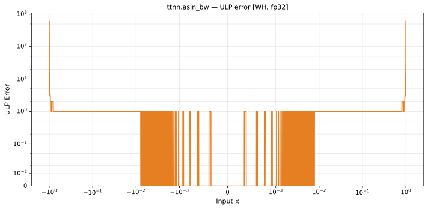

### [asinh](asinh.md)

### [asinh_bw](asinh_bw.md)

### [atan](atan.md)

### [atan2](atan2.md)

### [atan2_bw](atan2_bw.md)

### [atan_bw](atan_bw.md)

### [atanh](atanh.md)

### [atanh_bw](atanh_bw.md)

### [bias_gelu](bias_gelu.md)

### [bias_gelu_](bias_gelu_.md)

### [cbrt](cbrt.md)

### [ceil](ceil.md)

### [celu](celu.md)

### [celu_bw](celu_bw.md)

### [clamp](clamp.md)

### [clamp_bw](clamp_bw.md)

### [clip](clip.md)

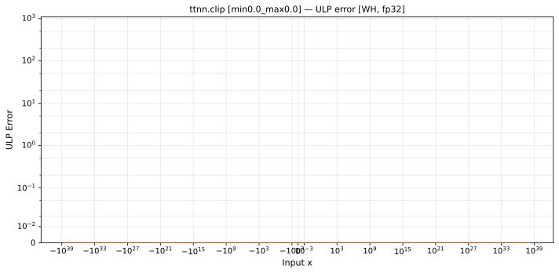

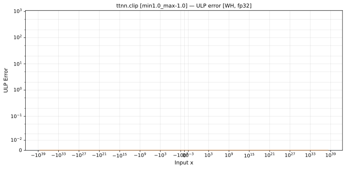

### [clip_bw](clip_bw.md)

### [cos](cos.md)

### [cos_bw](cos_bw.md)

### [cosh](cosh.md)

### [cosh_bw](cosh_bw.md)

### [deg2rad](deg2rad.md)

### [digamma](digamma.md)

### [digamma_bw](digamma_bw.md)

### [div](div.md)

### [div_bw](div_bw.md)

### [div_no_nan](div_no_nan.md)

### [divide](divide.md)

### [divide_](divide_.md)

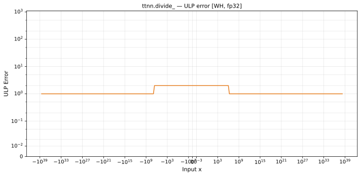

### [elu](elu.md)

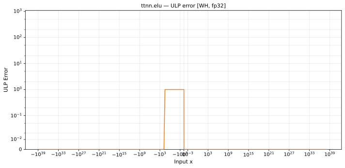

### [elu_bw](elu_bw.md)

### [eq](eq.md)

### [eq_](eq_.md)

### [eqz](eqz.md)

### [erf](erf.md)

### [erf_bw](erf_bw.md)

### [erfc](erfc.md)

### [erfc_bw](erfc_bw.md)

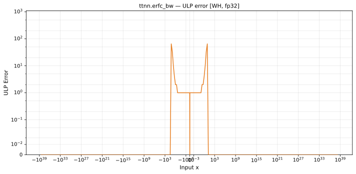

### [erfinv](erfinv.md)

### [erfinv_bw](erfinv_bw.md)

### [exp](exp.md)

### [exp2](exp2.md)

### [exp2_bw](exp2_bw.md)

### [exp_bw](exp_bw.md)

### [expm1](expm1.md)

### [expm1_bw](expm1_bw.md)

### [floor](floor.md)

### [floor_div](floor_div.md)

### [fmod](fmod.md)

### [frac](frac.md)

### [ge](ge.md)

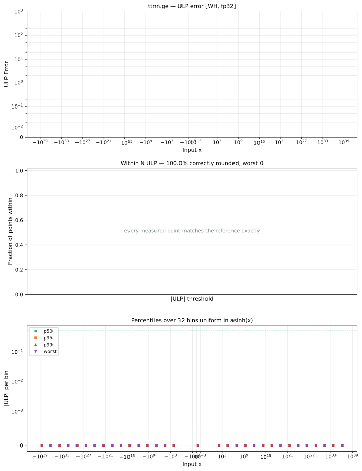

### [ge_](ge_.md)

### [gelu](gelu.md)

### [gelu_bw](gelu_bw.md)

### [gez](gez.md)

### [gt](gt.md)

### [gt_](gt_.md)

### [gtz](gtz.md)

### [hardmish](hardmish.md)

### [hardshrink](hardshrink.md)

### [hardshrink_bw](hardshrink_bw.md)

### [hardsigmoid](hardsigmoid.md)

### [hardsigmoid_bw](hardsigmoid_bw.md)

### [hardswish](hardswish.md)

### [hardswish_bw](hardswish_bw.md)

### [hardtanh](hardtanh.md)

### [hardtanh_bw](hardtanh_bw.md)

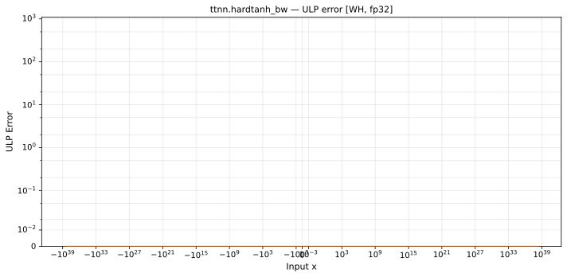

### [heaviside](heaviside.md)

### [hypot](hypot.md)

### [hypot_bw](hypot_bw.md)

### [i0](i0.md)

### [i0_bw](i0_bw.md)

### [identity](identity.md)

### [isclose](isclose.md)

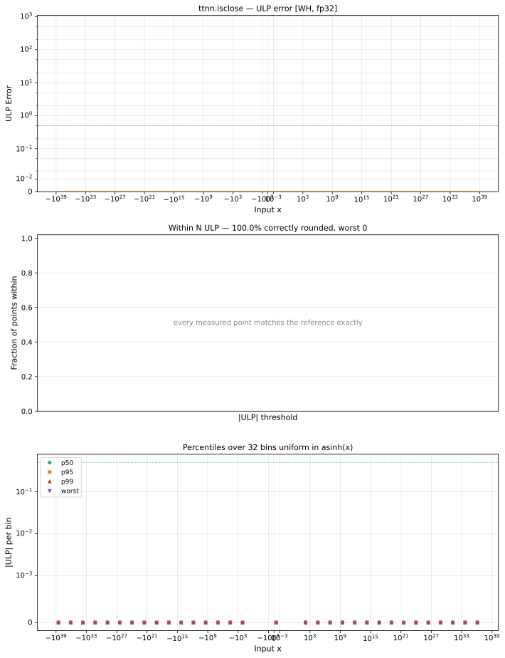

### [isfinite](isfinite.md)

### [isinf](isinf.md)

### [isnan](isnan.md)

### [isneginf](isneginf.md)

### [isposinf](isposinf.md)

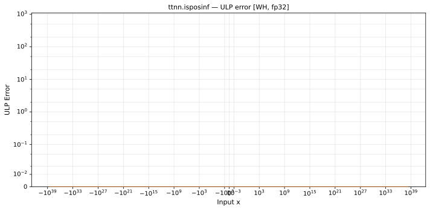

### [l1_loss](l1_loss.md)

### [ldexp](ldexp.md)

### [ldexp_](ldexp_.md)

### [ldexp_bw](ldexp_bw.md)

### [le](le.md)

### [le_](le_.md)

### [leaky_relu](leaky_relu.md)

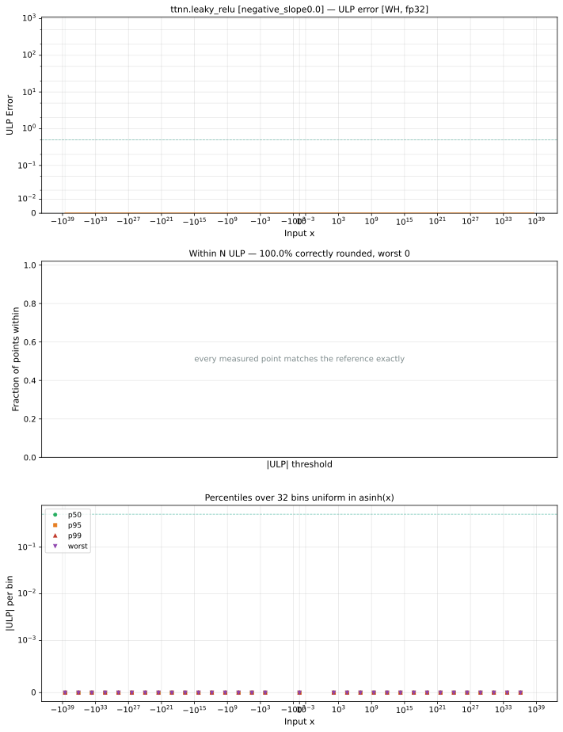

### [leaky_relu_bw](leaky_relu_bw.md)

### [lerp](lerp.md)

### [lerp_bw](lerp_bw.md)

### [lez](lez.md)

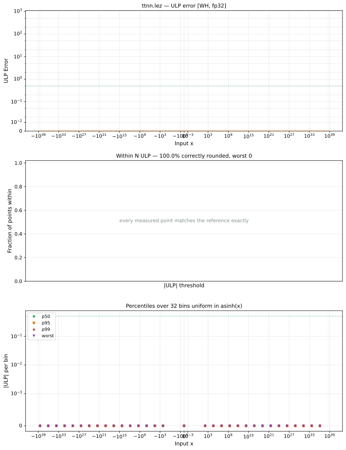

### [lgamma](lgamma.md)

### [lgamma_bw](lgamma_bw.md)

### [log](log.md)

### [log10](log10.md)

### [log10_bw](log10_bw.md)

### [log1p](log1p.md)

### [log1p_bw](log1p_bw.md)

### [log2](log2.md)

### [log2_bw](log2_bw.md)

### [log_bw](log_bw.md)

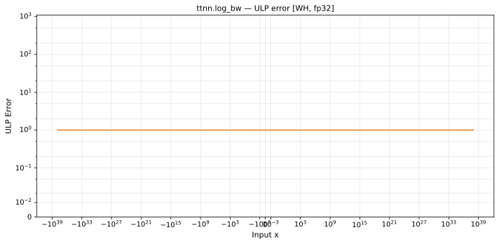

### [log_sigmoid](log_sigmoid.md)

### [log_sigmoid_bw](log_sigmoid_bw.md)

### [logaddexp](logaddexp.md)

### [logaddexp2](logaddexp2.md)

### [logaddexp2_](logaddexp2_.md)

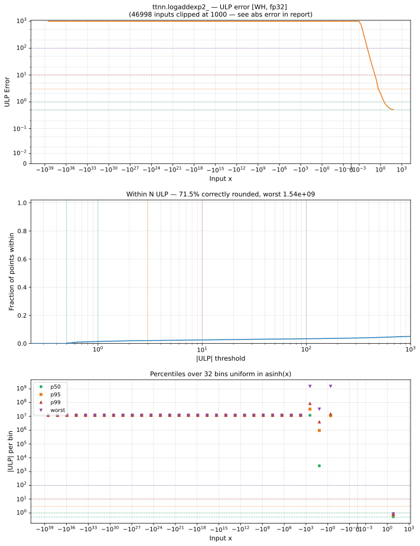

### [logaddexp2_bw](logaddexp2_bw.md)

### [logaddexp_](logaddexp_.md)

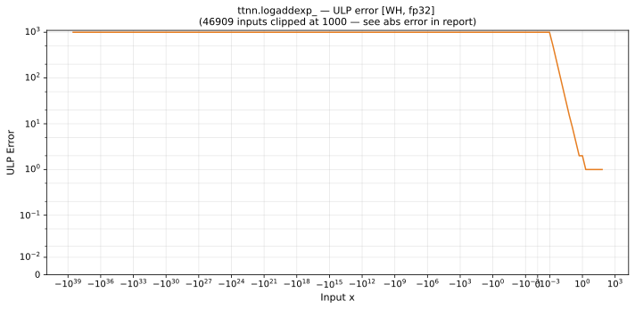

### [logaddexp_bw](logaddexp_bw.md)

### [logical_and](logical_and.md)

### [logical_and_](logical_and_.md)

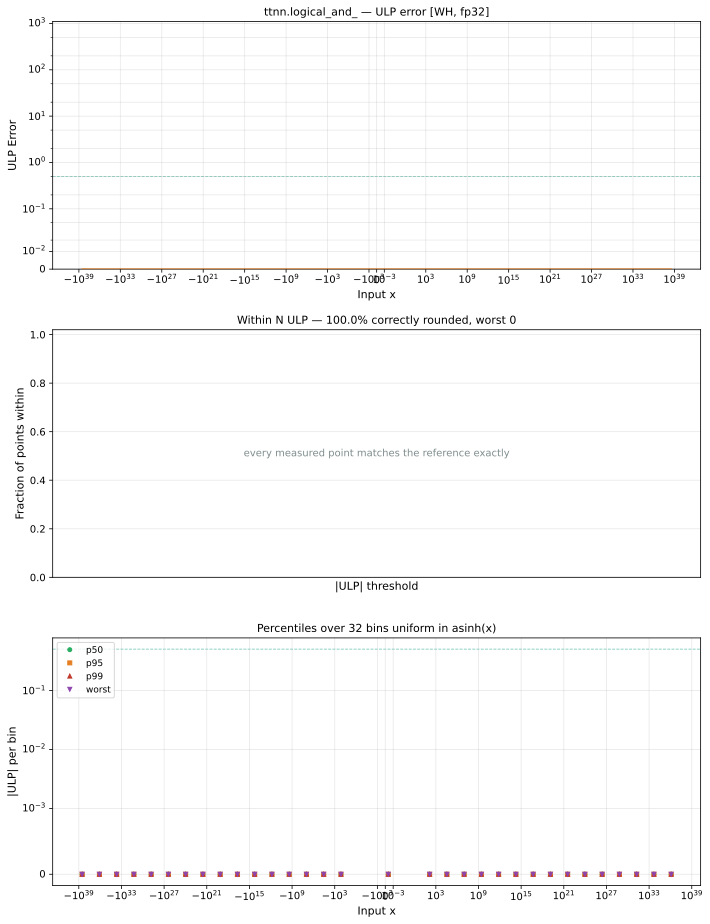

### [logical_not](logical_not.md)

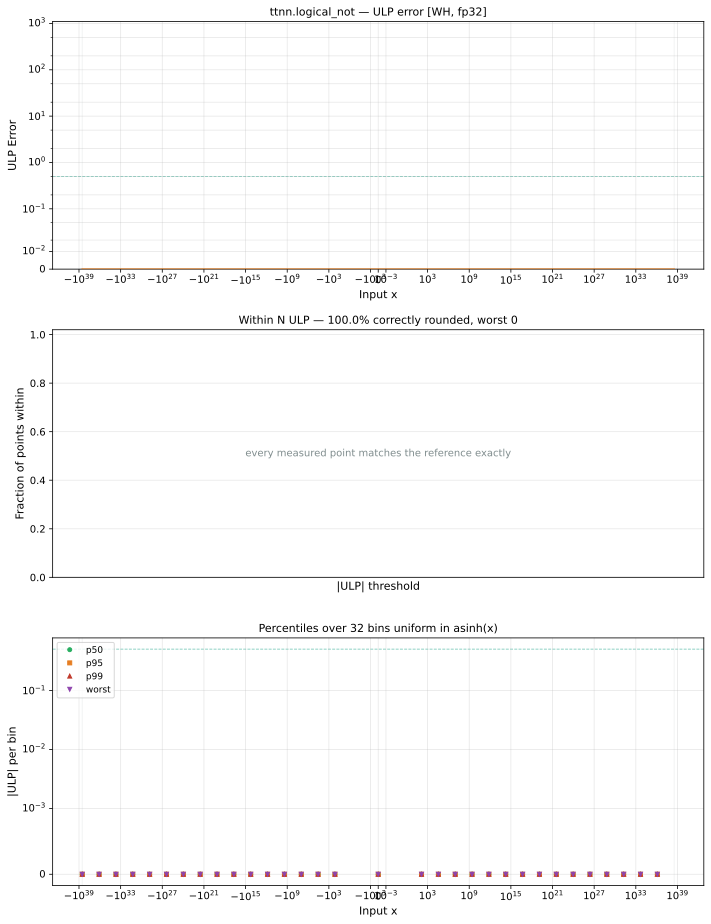

### [logical_not_](logical_not_.md)

### [logical_or](logical_or.md)

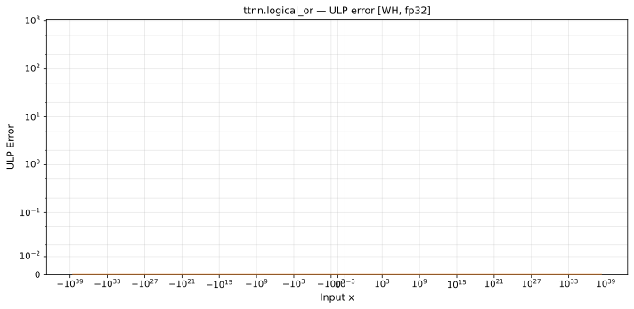

### [logical_or_](logical_or_.md)

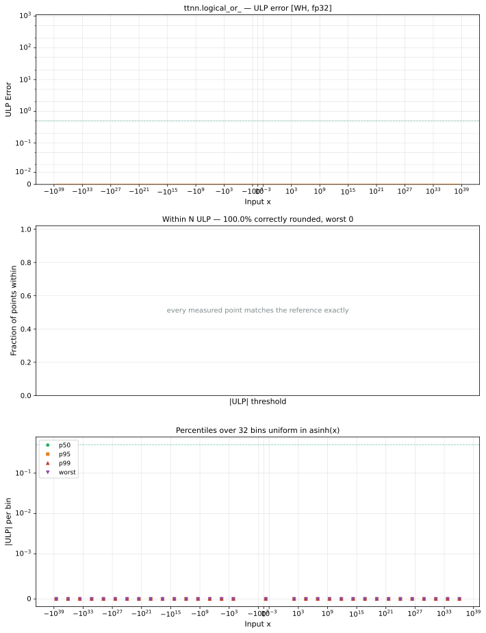

### [logical_xor_](logical_xor_.md)

### [logit](logit.md)

### [logit_bw](logit_bw.md)

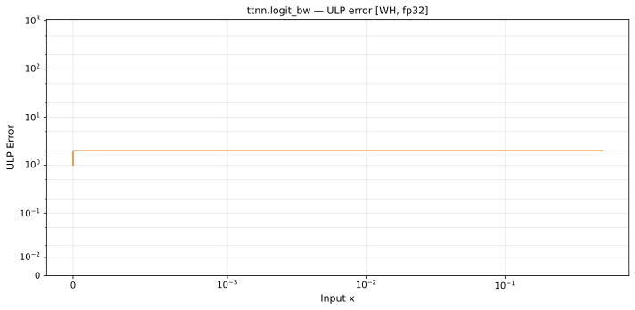

### [logiteps_bw](logiteps_bw.md)

### [lt](lt.md)

### [lt_](lt_.md)

### [ltz](ltz.md)

### [mac](mac.md)

### [max_bw](max_bw.md)

### [maximum](maximum.md)

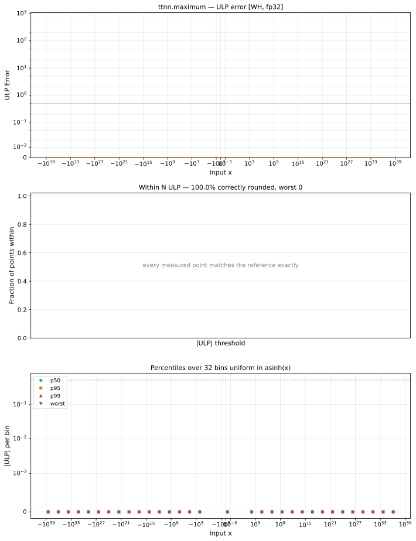

### [min_bw](min_bw.md)

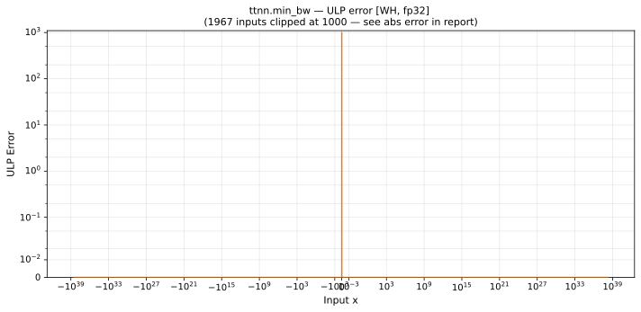

### [minimum](minimum.md)

### [mish](mish.md)

### [mse_loss](mse_loss.md)

### [mul_bw](mul_bw.md)

### [multigammaln](multigammaln.md)

### [multigammaln_bw](multigammaln_bw.md)

### [multiply](multiply.md)

### [multiply_](multiply_.md)

### [ne](ne.md)

### [ne_](ne_.md)

### [neg](neg.md)

### [nextafter](nextafter.md)

### [nez](nez.md)

### [polygamma](polygamma.md)

### [polygamma_bw](polygamma_bw.md)

### [pow](pow.md)

### [pow_bw](pow_bw.md)

### [prelu](prelu.md)

### [rad2deg](rad2deg.md)

### [rdiv](rdiv.md)

### [rdiv_bw](rdiv_bw.md)

### [reciprocal](reciprocal.md)

### [reciprocal_bw](reciprocal_bw.md)

### [relu](relu.md)

### [relu6](relu6.md)

### [relu6_bw](relu6_bw.md)

### [relu_bw](relu_bw.md)

### [relu_max](relu_max.md)

### [relu_min](relu_min.md)

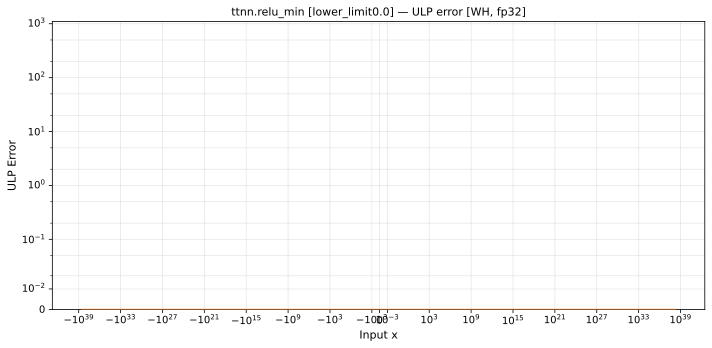

### [remainder](remainder.md)

### [round](round.md)

### [rpow](rpow.md)

### [rpow_bw](rpow_bw.md)

### [rsqrt](rsqrt.md)

### [rsqrt_bw](rsqrt_bw.md)

### [rsub](rsub.md)

### [rsub_](rsub_.md)

### [selu](selu.md)

### [selu_bw](selu_bw.md)

### [sigmoid](sigmoid.md)

### [sigmoid_accurate](sigmoid_accurate.md)

### [sigmoid_bw](sigmoid_bw.md)

### [sign](sign.md)

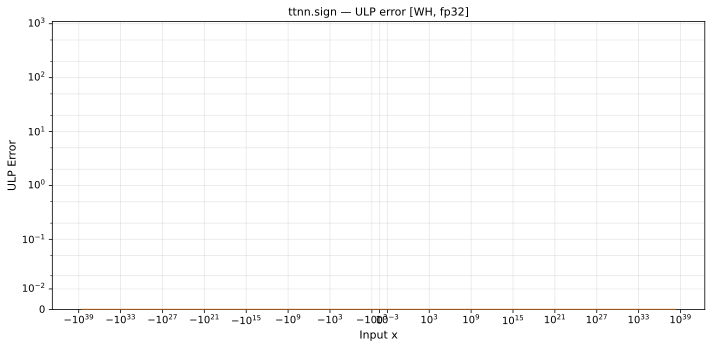

### [signbit](signbit.md)

### [silu](silu.md)

### [silu_bw](silu_bw.md)

### [sin](sin.md)

### [sin_bw](sin_bw.md)

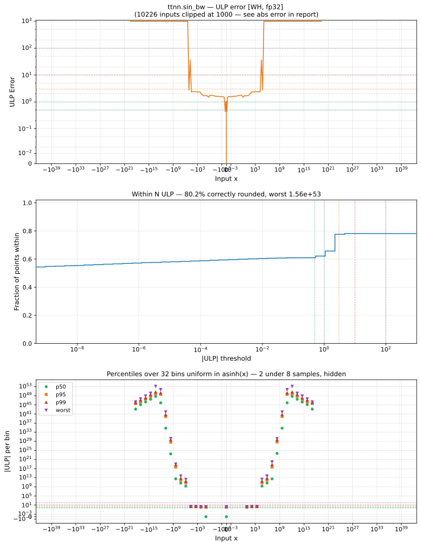

### [sinh](sinh.md)

### [sinh_bw](sinh_bw.md)

### [softplus](softplus.md)

### [softplus_bw](softplus_bw.md)

### [softshrink](softshrink.md)

### [softshrink_bw](softshrink_bw.md)

### [softsign](softsign.md)

### [softsign_bw](softsign_bw.md)

### [sqrt](sqrt.md)

### [sqrt_bw](sqrt_bw.md)

### [square](square.md)

### [square_bw](square_bw.md)

### [squared_difference](squared_difference.md)

### [squared_difference_](squared_difference_.md)

### [squared_difference_bw](squared_difference_bw.md)

### [subalpha](subalpha.md)

### [subtract](subtract.md)

### [subtract_](subtract_.md)

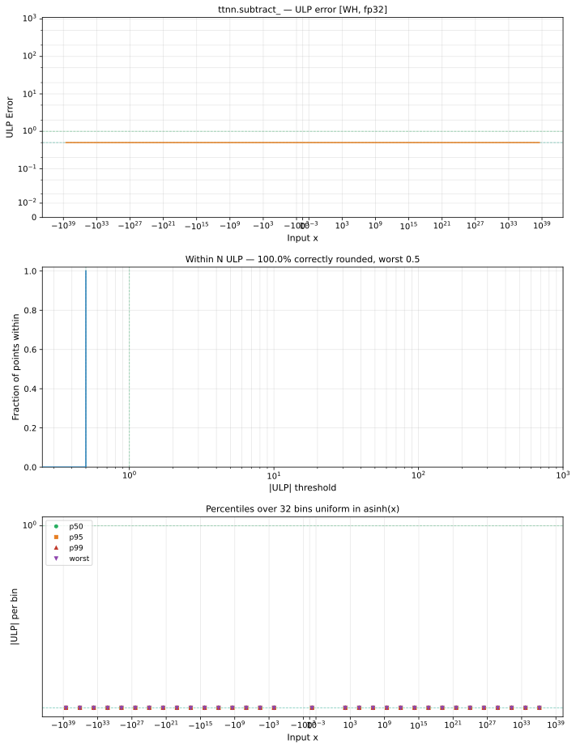

### [swish](swish.md)

### [tan](tan.md)

### [tan_bw](tan_bw.md)

### [tanh](tanh.md)

### [tanh_bw](tanh_bw.md)

### [tanhshrink](tanhshrink.md)

### [tanhshrink_bw](tanhshrink_bw.md)

### [threshold](threshold.md)

### [threshold_bw](threshold_bw.md)

### [trunc](trunc.md)

### [where](where.md)

### [xielu](xielu.md)

### [xlogy](xlogy.md)

### [xlogy_bw](xlogy_bw.md)

