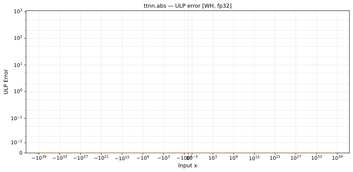

# abs — Wormhole (WH), float32
_This page is auto-generated by `scripts/generate_reports.py`. Do not edit manually._

_Generated: 2026-04-28 23:06 UTC_

**Architecture:** Wormhole (WH)  
**Data type:** float32  

---

[← Wormhole (WH) float32 ops](README.md) | [All archs for abs](../../../by_op/abs/README.md) | [Top](../../../README.md)

| Parameters | Max ULP | Mean ULP | Max abs error |
|------------|---------|----------|---------------|
| `default` | 0 | 0 | 0 |

