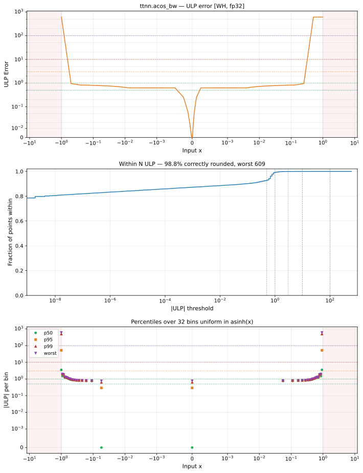

# acos_bw — Wormhole (WH), float32
_This page is auto-generated by `ttnn-accuracy report`. Do not edit manually._

**Architecture:** Wormhole (WH)  
**Data type:** float32  

---

[← Wormhole (WH) float32 ops](README.md) | [All archs for acos_bw](../../../by_op/acos_bw/README.md) | [Top](../../../README.md)

**Measured input range:** x ∈ [-1, 1]  

|  | `default` |
|---|---|
| Max ULP | 609 |
| Min ULP | 0 |
| Mean ULP | 1.34 |
| Signed bias (ULP) | -0.467 |
| p50 ULP | 0 |
| p95 ULP | 0.621 |
| p99 ULP | 0.888 |
| Exact fraction | 0.928 |
| Correctly rounded | 0.988 |
| Accurate to \|x\| | 0.926 |
| Max abs error | 0.00232 |
| Max rel error | 4.32e-05 |
| Median rel error | 8.37e-08 |
| Bits of precision (worst) | 14.5 |
| Bits of precision (median) | 23.5 |

**default** — accurate to |x| <= 0.926  

**Outcomes**

| Parameters | exact | faithful | inexact |
|---|---|---|---|
| `default` | 29,938 | 2,076 | 242 |

**Worst points**

| Parameters | x | golden | device | ULP |
|---|---|---|---|---|
| `default` | 0.9998274 | -53.822567 | -53.820244 | 609 |
| `default` | -0.9998274 | -53.822567 | -53.820244 | 609 |
| `default` | 0.99608994 | -11.319259 | -11.319281 | 23.3 |
| `default` | -0.99608994 | -11.319259 | -11.319281 | 23.3 |
| `default` | 0.99215513 | -7.9991837 | -7.9991918 | 16.7 |
| `default` | -0.99215513 | -7.9991837 | -7.9991918 | 16.7 |
| `default` | 0.98822415 | -6.535385 | -6.5353894 | 9.43 |
| `default` | -0.98822415 | -6.535385 | -6.5353894 | 9.43 |
| `default` | 0.9841412 | -5.637391 | -5.637394 | 6.21 |
| `default` | -0.9841412 | -5.637391 | -5.637394 | 6.21 |

**Monotonicity**

_Checked only where the reference is itself ordered, and never across a discontinuity._

| Parameters | Pairs | Violations | Rate | Worst \|Δy\| |
|---|---|---|---|---|
| `default` | 32,254 | 0 | 0 | 0 |

### Special values

| Variant | x | device | golden |  |
|---|---|---|---|---|
| `default` | 0 | -1 | -1 | agree |
| `default` | -0 | -1 | -1 | agree |
| `default` | inf | nan | nan | agree |
| `default` | -inf | nan | nan | agree |
| `default` | nan | nan | nan | agree |
| `default` | 1.1754944e-38 | -1 | -1 | agree |
| `default` | -1.1754944e-38 | -1 | -1 | agree |

> **Provenance unknown.** These figures predate run tracking. Re-measure to attribute them.

