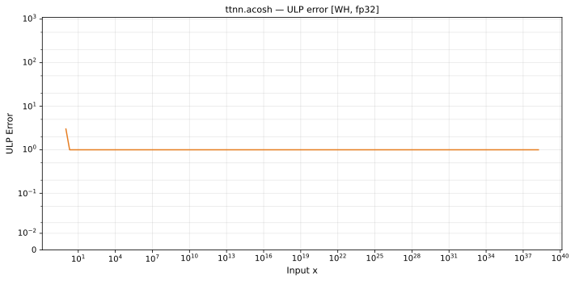

# acosh — Wormhole (WH), float32
_This page is auto-generated by `ttnn-accuracy report`. Do not edit manually._

**Architecture:** Wormhole (WH)  
**Data type:** float32  

---

[← Wormhole (WH) float32 ops](README.md) | [All archs for acosh](../../../by_op/acosh/README.md) | [Top](../../../README.md)

**Measured input range:** x ∈ [1, 3.403e+38]  

|  | `default` |
|---|---|
| Max ULP | 2.76 |
| Min ULP | 0.524 |
| Mean ULP | 0.764 |
| Signed bias (ULP) | 0.275 |
| p50 ULP | 0.786 |
| p95 ULP | 0.961 |
| p99 ULP | 1.17 |
| Exact fraction | 0 |
| Correctly rounded | 0.782 |
| Accurate to \|x\| | nowhere |
| Max abs error | 5.54e-06 |
| Max rel error | 1.67e-07 |
| Median rel error | 6.51e-08 |
| Bits of precision (worst) | 22.5 |
| Bits of precision (median) | 23.9 |

**default** — never within 2 ULP  

**Outcomes**

| Parameters | faithful | inexact |
|---|---|---|
| `default` | 16,182 | 202 |

**Worst points**

| Parameters | x | golden | device | ULP |
|---|---|---|---|---|
| `default` | 1.0018948 | 0.061550524 | 0.061550535 | 2.76 |
| `default` | 1.0266818 | 0.23049496 | 0.230495 | 2.59 |
| `default` | 1.1249937 | 0.49492067 | 0.49492073 | 2.23 |
| `default` | 1.1148266 | 0.47475034 | 0.4747504 | 2.22 |
| `default` | 1.1061257 | 0.45672745 | 0.4567275 | 2.15 |
| `default` | 1.1010338 | 0.44581813 | 0.44581807 | 2.08 |
| `default` | 1.1270136 | 0.4988233 | 0.49882334 | 2.07 |
| `default` | 1.0879992 | 0.4165046 | 0.41650465 | 2.05 |
| `default` | 1.0312504 | 0.24935491 | 0.24935494 | 2.04 |
| `default` | 1.0835825 | 0.4060627 | 0.40606263 | 2.02 |

**Monotonicity**

_Checked only where the reference is itself ordered, and never across a discontinuity._

| Parameters | Pairs | Violations | Rate | Worst \|Δy\| |
|---|---|---|---|---|
| `default` | 16,383 | 0 | 0 | 0 |

### Special values

| Variant | x | device | golden |  |
|---|---|---|---|---|
| `default` | 0 | nan | nan | agree |
| `default` | -0 | nan | nan | agree |
| `default` | inf | inf | inf | agree |
| `default` | -inf | nan | nan | agree |
| `default` | nan | nan | nan | agree |
| `default` | 1.1754944e-38 | nan | nan | agree |
| `default` | -1.1754944e-38 | nan | nan | agree |

> **Provenance unknown.** These figures predate run tracking. Re-measure to attribute them.

