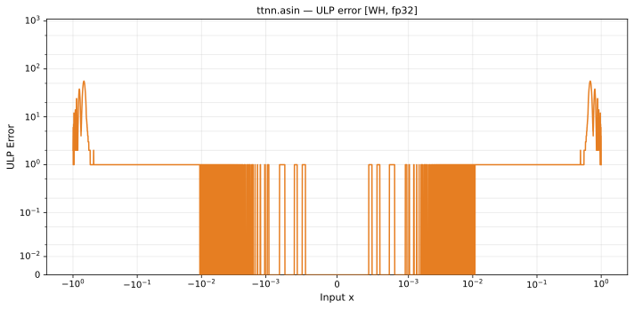

# asin — Wormhole (WH), float32
_This page is auto-generated by `ttnn-accuracy report`. Do not edit manually._

_Generated: 2026-08-26 07:39_

**Architecture:** Wormhole (WH)  
**Data type:** float32  
**Valid domain:** x ∈ [-1, 1]  

---

[← Wormhole (WH) float32 ops](README.md) | [All archs for asin](../../../by_op/asin/README.md) | [Top](../../../README.md)

**Measured input range:** x ∈ [-1, 1]  

| Parameters | Max ULP | Mean ULP | Max abs error |
|------------|---------|----------|---------------|
| `default` | 56 | 0.159 | 3.34e-06 |

