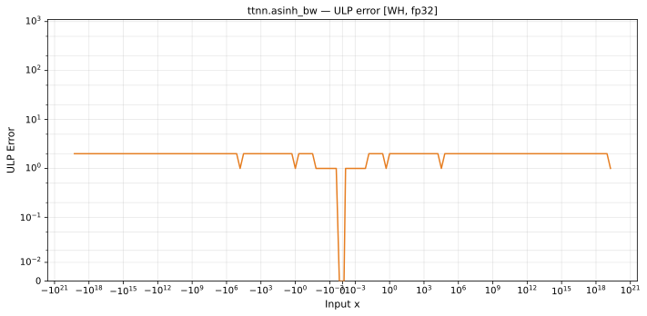

# asinh_bw — Wormhole (WH), float32
_This page is auto-generated by `ttnn-accuracy report`. Do not edit manually._

_Generated: 2026-08-31 08:14_

**Architecture:** Wormhole (WH)  
**Data type:** float32  

---

[← Wormhole (WH) float32 ops](README.md) | [All archs for asinh_bw](../../../by_op/asinh_bw/README.md) | [Top](../../../README.md)

**Measured input range:** x ∈ [-8.507e+37, 8.507e+37]  

| Parameters | Max ULP | Mean ULP | Accurate to \|x\| | Max abs error |
|------------|---------|----------|-----------------|---------------|
| `default` | 2 | 1.03 | 8.51e+37 | 1.19e-07 |

**default** — within 2 ULP everywhere  

**Outcomes**

| Parameters | exact | inexact | zeroed |
|------------|------|------|------|
| `default` | 29,956 | 18,684 | 15,874 |

### Special values

| Variant | x | device | golden | |
|---|---|---|---|---|
| `default` | 0 | 1 | 1 | agree |
| `default` | -0 | 1 | 1 | agree |
| `default` | inf | 0 | 0 | agree |
| `default` | -inf | 0 | 0 | agree |
| `default` | nan | nan | nan | agree |
| `default` | 1.175e-38 | 1 | 1 | agree |
| `default` | -1.175e-38 | 1 | 1 | agree |

_Measured on WORMHOLE_B0 · tt-metal `2adf8c65887` · ttnn `0.75.0rc10.dev817+g2adf8c65887` · run `20260831T073009`_

