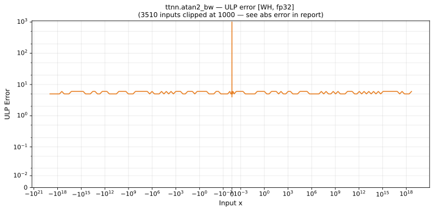

# atan2_bw — Wormhole (WH), float32
_This page is auto-generated by `ttnn-accuracy report`. Do not edit manually._

**Architecture:** Wormhole (WH)  
**Data type:** float32  

---

[← Wormhole (WH) float32 ops](README.md) | [All archs for atan2_bw](../../../by_op/atan2_bw/README.md) | [Top](../../../README.md)

**Measured input range:** all normal values  

|  | `default` |
|---|---|
| Max ULP | 1.64e+07 ⚠ |
| Min ULP | 2.53 |
| Mean ULP | 9.5e+04 |
| Signed bias (ULP) | -8.05e+04 |
| p50 ULP | 4.06 |
| p95 ULP | 2.06e+04 |
| p99 ULP | 3.62e+06 |
| Exact fraction | 0 |
| Correctly rounded | 0.61 |
| Max abs error | 4.5e+18 |
| Max rel error | 0.982 |
| Median rel error | 2.56e-07 |
| Bits of precision (worst) | 0.026 |
| Bits of precision (median) | 21.9 |

**default** — worst pairing 1.64e+07 ULP; mean 9.5e+04  

**Outcomes**

| Parameters | flushed | inexact |
|---|---|---|
| `default` | 16,640 | 48,384 |

**Worst points**

| Parameters | x | x2 | golden | device | ULP |
|---|---|---|---|---|---|
| `default` | 1.091165e-19 | 1.0813723e-19 | 4.5820723e+18 | 9.08227e+18 | 1.64e+07 |
| `default` | -1.0917448e-19 | 1.0813723e-19 | 4.5796163e+18 | 9.072626e+18 | 1.63e+07 |
| `default` | 1.0941835e-19 | 1.0813723e-19 | 4.5693004e+18 | 9.032228e+18 | 1.62e+07 |
| `default` | -1.0991701e-19 | 1.0813723e-19 | 4.5482802e+18 | 8.950461e+18 | 1.6e+07 |
| `default` | 1.1040046e-19 | 1.0813723e-19 | 4.5279953e+18 | 8.872244e+18 | 1.58e+07 |
| `default` | -1.1089437e-19 | 1.0813723e-19 | 4.5073666e+18 | 8.7933893e+18 | 1.56e+07 |
| `default` | -1.1109003e-19 | 1.0813723e-19 | 4.499221e+18 | 8.7624397e+18 | 1.55e+07 |
| `default` | 1.1139672e-19 | 1.0813723e-19 | 4.4864838e+18 | 8.7142586e+18 | 1.54e+07 |
| `default` | 1.1209174e-19 | 1.0813723e-19 | 4.4577566e+18 | 8.6065295e+18 | 1.51e+07 |
| `default` | -1.1238798e-19 | 1.0813723e-19 | 4.4455696e+18 | 8.5612164e+18 | 1.5e+07 |

### Special values

| Variant | x | device | golden |  |
|---|---|---|---|---|
| `default` | 0 | 1 | 1 | agree |
| `default` | -0 | 1 | 1 | agree |
| `default` | inf | 0 | 0 | agree |
| `default` | -inf | 0 | 0 | agree |
| `default` | nan | 0 | nan | **differ** |
| `default` | 1.1754944e-38 | 1 | 1 | agree |
| `default` | -1.1754944e-38 | 1 | 1 | agree |

> **Sampled, not exhaustive.** For this op both operands take 65,536 of the 2³² fp32 values, drawn once from a fixed seed. The figures above are a lower bound on the error, and comparable between releases, but they are not a bound over the dtype.

_Measured on WORMHOLE_B0 · tt-metal `a3a9fb4229a` · ttnn `0.78.0` · run `20260929T111356`_

