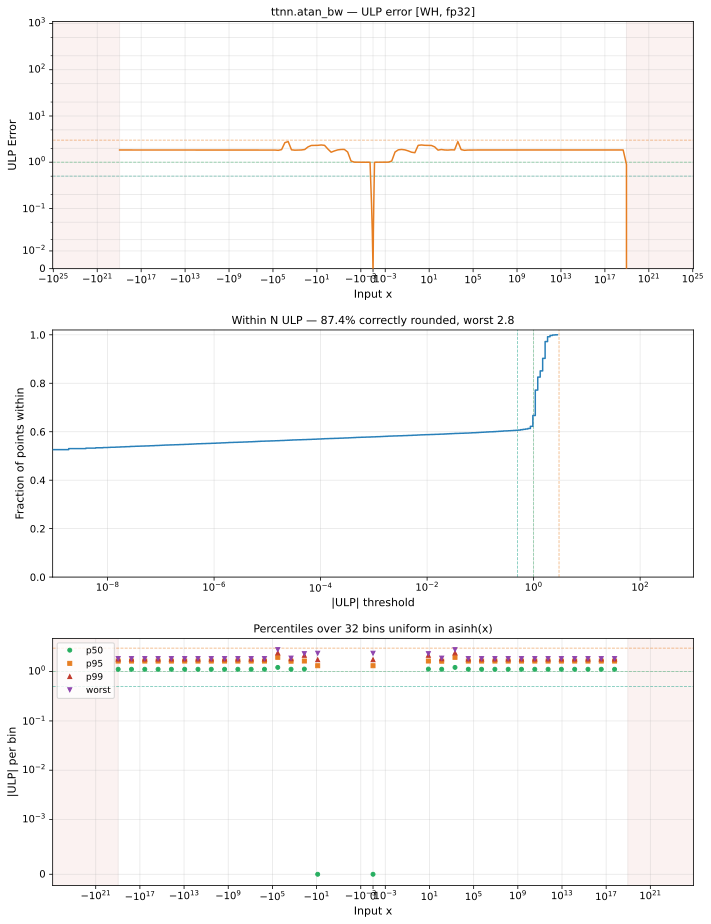

# atan_bw — Wormhole (WH), float32
_This page is auto-generated by `ttnn-accuracy report`. Do not edit manually._

**Architecture:** Wormhole (WH)  
**Data type:** float32  

---

[← Wormhole (WH) float32 ops](README.md) | [All archs for atan_bw](../../../by_op/atan_bw/README.md) | [Top](../../../README.md)

**Measured input range:** x ∈ [-9.223e+18, 9.223e+18]  

|  | `default` |
|---|---|
| Max ULP | 2.8 |
| Min ULP | 0 |
| Mean ULP | 1.23 |
| Signed bias (ULP) | 0.698 |
| p50 ULP | 0 |
| p95 ULP | 1.57 |
| p99 ULP | 1.8 |
| Exact fraction | 0.606 |
| Correctly rounded | 0.874 |
| Accurate to \|x\| | 1.01 |
| Max abs error | 1.13e-07 |
| Max rel error | 1.67e-07 |
| Median rel error | 1.02e-07 |
| Bits of precision (worst) | 22.5 |
| Bits of precision (median) | 23.2 |

**default** — accurate to |x| <= 1.01; up to 2.8 ULP beyond  

**Outcomes**

| Parameters | exact | faithful | inexact |
|---|---|---|---|
| `default` | 29,346 | 3,380 | 15,660 |

**Worst points**

| Parameters | x | golden | device | ULP |
|---|---|---|---|---|
| `default` | 4103.003 | 5.940135e-08 | 5.940134e-08 | 2.8 |
| `default` | -4103.003 | 5.940135e-08 | 5.940134e-08 | 2.8 |
| `default` | 4129.5415 | 5.8640317e-08 | 5.8640307e-08 | 2.65 |
| `default` | -4129.5415 | 5.8640317e-08 | 5.8640307e-08 | 2.65 |
| `default` | 4168.5874 | 5.7546927e-08 | 5.7546938e-08 | 2.53 |
| `default` | -4168.5874 | 5.7546927e-08 | 5.7546938e-08 | 2.53 |
| `default` | 4202.5693 | 5.6620042e-08 | 5.6620035e-08 | 2.5 |
| `default` | -4202.5693 | 5.6620042e-08 | 5.6620035e-08 | 2.5 |
| `default` | 4238.102 | 5.5674608e-08 | 5.5674615e-08 | 2.45 |
| `default` | -4238.102 | 5.5674608e-08 | 5.5674615e-08 | 2.45 |

**Monotonicity**

_Checked only where the reference is itself ordered, and never across a discontinuity._

| Parameters | Pairs | Violations | Rate | Worst \|Δy\| |
|---|---|---|---|---|
| `default` | 48,384 | 0 | 0 | 0 |

### Special values

| Variant | x | device | golden |  |
|---|---|---|---|---|
| `default` | 0 | 1 | 1 | agree |
| `default` | -0 | 1 | 1 | agree |
| `default` | inf | 0 | 0 | agree |
| `default` | -inf | 0 | 0 | agree |
| `default` | nan | 0 | nan | **differ** |
| `default` | 1.1754944e-38 | 1 | 1 | agree |
| `default` | -1.1754944e-38 | 1 | 1 | agree |

_Measured on WORMHOLE_B0 · tt-metal `a3a9fb4229a` · ttnn `0.78.0` · run `20260929T111615`_

