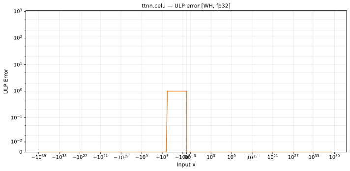

# celu — Wormhole (WH), float32
_This page is auto-generated by `ttnn-accuracy report`. Do not edit manually._

**Architecture:** Wormhole (WH)  
**Data type:** float32  

---

[← Wormhole (WH) float32 ops](README.md) | [All archs for celu](../../../by_op/celu/README.md) | [Top](../../../README.md)

**Measured input range:** x ∈ [-3.403e+38, 3.403e+38]  

|  | `default` |
|---|---|
| Max ULP | 1.36 |
| Min ULP | 0 |
| Mean ULP | 0.799 |
| Signed bias (ULP) | -0.262 |
| p50 ULP | 0 |
| p95 ULP | 0.321 |
| p99 ULP | 0.935 |
| Exact fraction | 0.956 |
| Correctly rounded | 0.99 |
| Accurate to \|x\| | 3.39e+38 |
| Max abs error | 4.68e-08 |
| Max rel error | 1.24e-07 |
| Median rel error | 6.55e-08 |
| Bits of precision (worst) | 22.9 |
| Bits of precision (median) | 23.9 |

**default** — within 2 ULP  

**Outcomes**

| Parameters | exact | faithful | inexact |
|---|---|---|---|
| `default` | 62,154 | 2,544 | 326 |

**Worst points**

| Parameters | x | golden | device | ULP |
|---|---|---|---|---|
| `default` | -0.1331235 | -0.12464302 | -0.12464301 | 1.36 |
| `default` | -0.1308194 | -0.12262378 | -0.12262377 | 1.36 |
| `default` | -0.13217849 | -0.1238154 | -0.123815395 | 1.35 |
| `default` | -0.13141769 | -0.12314855 | -0.123148546 | 1.35 |
| `default` | -0.12886062 | -0.120903514 | -0.12090351 | 1.34 |
| `default` | -0.12968184 | -0.12162515 | -0.12162514 | 1.34 |
| `default` | -0.12745002 | -0.11966258 | -0.119662575 | 1.32 |
| `default` | -0.12583597 | -0.11824053 | -0.11824052 | 1.31 |
| `default` | -0.12658761 | -0.11890305 | -0.11890304 | 1.31 |
| `default` | -0.12459869 | -0.11714887 | -0.11714886 | 1.3 |

**Monotonicity**

_Checked only where the reference is itself ordered, and never across a discontinuity._

| Parameters | Pairs | Violations | Rate | Worst \|Δy\| |
|---|---|---|---|---|
| `default` | 65,022 | 0 | 0 | 0 |

### Special values

| Variant | x | device | golden |  |
|---|---|---|---|---|
| `default` | 0 | 0 | 0 | agree |
| `default` | -0 | 0 | -0 | **differ** |
| `default` | inf | inf | inf | agree |
| `default` | -inf | -1 | -1 | agree |
| `default` | nan | nan | nan | agree |
| `default` | 1.1754944e-38 | 1.1754944e-38 | 1.1754944e-38 | agree |
| `default` | -1.1754944e-38 | -1.1754944e-38 | -1.1754944e-38 | agree |

_Measured on WORMHOLE_B0 · tt-metal `de546d3b146` · ttnn `0.79.0` · run `20261010T030007`_

