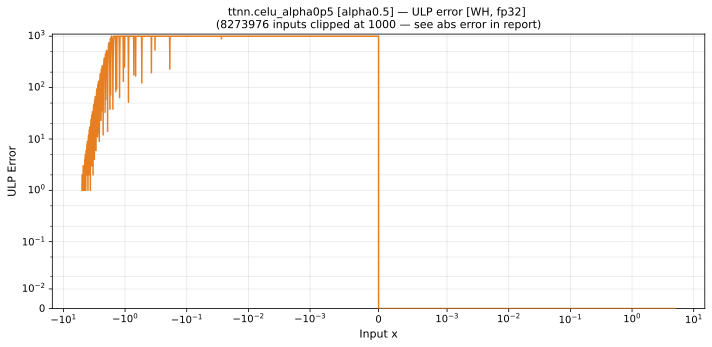
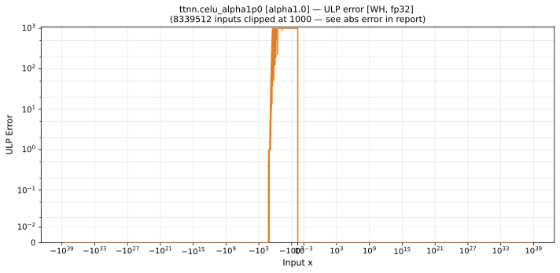

# celu — Wormhole (WH), float32
_This page is auto-generated by `scripts/generate_reports.py`. Do not edit manually._

_Generated: 2026-04-29 17:10 UTC_

**Architecture:** Wormhole (WH)  
**Data type:** float32  

---

[← Wormhole (WH) float32 ops](README.md) | [All archs for celu](../../../by_op/celu/README.md) | [Top](../../../README.md)

**Measured input range:** all normal values  

| Parameters | Max ULP | Mean ULP | Max abs error |
|------------|---------|----------|---------------|
| `alpha=0.5` | 3.01e+38 ⚠ | 1.21e+36 | 0.000864 |
| `alpha=1.0` | 3.01e+38 ⚠ | 1.21e+36 | 0.00173 |
| `alpha=2.0` | 3.01e+38 ⚠ | 1.21e+36 | 0.00345 |

> **Note (`alpha=0.5`):** ULP is not a useful metric near x ≈ 0 because the output itself is near zero. In x ∈ [-0.01, -1.18e-38] (7817135 inputs): max absolute error = **0.000864**.

> **Note (`alpha=1.0`):** ULP is not a useful metric near x ≈ 0 because the output itself is near zero. In x ∈ [-0.01, -1.18e-38] (7817135 inputs): max absolute error = **0.00173**.

> **Note (`alpha=2.0`):** ULP is not a useful metric near x ≈ 0 because the output itself is near zero. In x ∈ [-0.01, -1.18e-38] (7817135 inputs): max absolute error = **0.00345**.

### `alpha=0.5`

### `alpha=1.0`

### `alpha=2.0`

