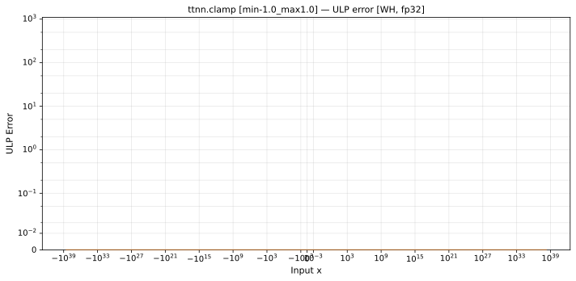
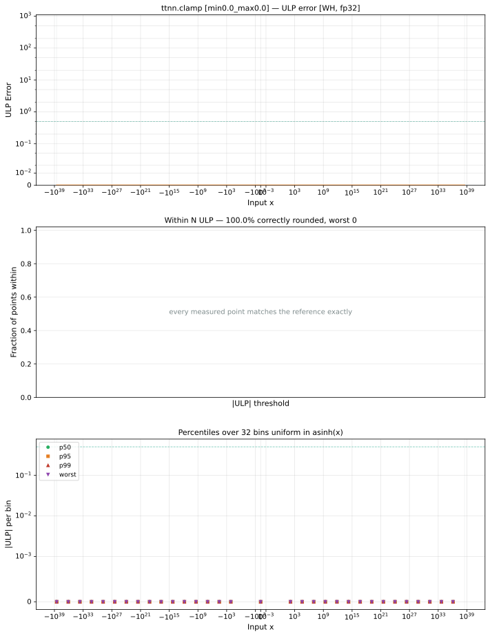
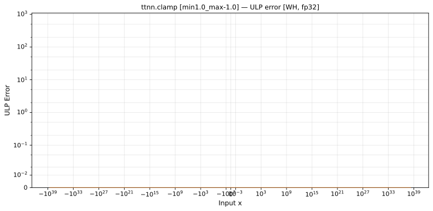

# clamp — Wormhole (WH), float32
_This page is auto-generated by `ttnn-accuracy report`. Do not edit manually._

**Architecture:** Wormhole (WH)  
**Data type:** float32  

---

[← Wormhole (WH) float32 ops](README.md) | [All archs for clamp](../../../by_op/clamp/README.md) | [Top](../../../README.md)

**Measured input range:** x ∈ [-3.403e+38, 3.403e+38]  

| Parameters | Max ULP | Mean ULP | Accurate to \|x\| | Max abs error |
|---|---|---|---|---------------|
| `min=-1.0,max=1.0` | 0 | — | 3.39e+38 | 0 |
| `min=0.0,max=0.0` | 0 | — | 3.39e+38 | 0 |
| `min=1.0,max=-1.0` | 0 | — | 3.39e+38 | 0 |

**min=-1.0,max=1.0** — bit-exact · _the symmetric unit interval_  
**min=0.0,max=0.0** — bit-exact · _collapsed interval — every output is 0_  
**min=1.0,max=-1.0** — bit-exact · _empty interval, min above max_  

**Outcomes**

| Parameters | exact |
|------------|------|
| `min=-1.0,max=1.0` | 65,024 |
| `min=0.0,max=0.0` | 65,024 |
| `min=1.0,max=-1.0` | 65,024 |

### Special values

| Variant | x | device | golden | |
|---|---|---|---|---|
| `min=-1.0,max=1.0` | 0 | 0 | 0 | agree |
| `min=-1.0,max=1.0` | -0 | -0 | -0 | agree |
| `min=-1.0,max=1.0` | inf | 1 | 1 | agree |
| `min=-1.0,max=1.0` | -inf | -1 | -1 | agree |
| `min=-1.0,max=1.0` | nan | 1 | nan | **differ** |
| `min=-1.0,max=1.0` | 1.175e-38 | 1.175e-38 | 1.175e-38 | agree |
| `min=-1.0,max=1.0` | -1.175e-38 | -1.175e-38 | -1.175e-38 | agree |
| `min=0.0,max=0.0` | 0 | 0 | 0 | agree |
| `min=0.0,max=0.0` | -0 | 0 | -0 | **differ** |
| `min=0.0,max=0.0` | inf | 0 | 0 | agree |
| `min=0.0,max=0.0` | -inf | 0 | 0 | agree |
| `min=0.0,max=0.0` | nan | 0 | nan | **differ** |
| `min=0.0,max=0.0` | 1.175e-38 | 0 | 0 | agree |
| `min=0.0,max=0.0` | -1.175e-38 | 0 | 0 | agree |
| `min=1.0,max=-1.0` | 0 | -1 | -1 | agree |
| `min=1.0,max=-1.0` | -0 | -1 | -1 | agree |
| `min=1.0,max=-1.0` | inf | -1 | -1 | agree |
| `min=1.0,max=-1.0` | -inf | -1 | -1 | agree |
| `min=1.0,max=-1.0` | nan | -1 | nan | **differ** |
| `min=1.0,max=-1.0` | 1.175e-38 | -1 | -1 | agree |
| `min=1.0,max=-1.0` | -1.175e-38 | -1 | -1 | agree |

_Measured on WORMHOLE_B0 · tt-metal `9f9cd4fd590` · ttnn `0.77.0` · run `20260915T152226`_

### `min=-1.0,max=1.0`

### `min=0.0,max=0.0`

### `min=1.0,max=-1.0`

