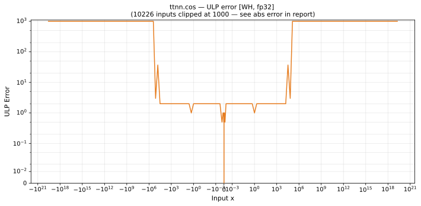

# cos — Wormhole (WH), float32
_This page is auto-generated by `scripts/generate_reports.py`. Do not edit manually._

_Generated: 2026-04-29 11:51 UTC_

**Architecture:** Wormhole (WH)  
**Data type:** float32  
**Valid domain:** BF16 argument reduction is undefined for |x| > ~128  

---

[← Wormhole (WH) float32 ops](README.md) | [All archs for cos](../../../by_op/cos/README.md) | [Top](../../../README.md)

**Measured input range:** x ∈ [-128, 128]  

| Parameters | Max ULP | Mean ULP | Max abs error |
|------------|---------|----------|---------------|
| `default` | 2 | 0.119 | 1.19e-07 |

