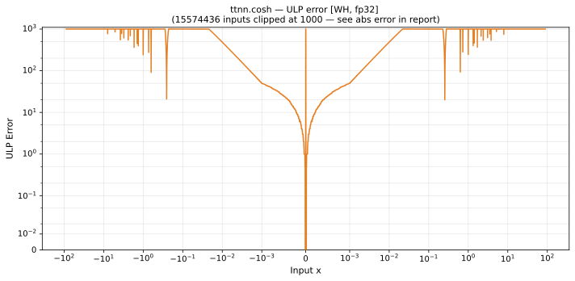

# cosh — Wormhole (WH), float32
_This page is auto-generated by `ttnn-accuracy report`. Do not edit manually._

**Architecture:** Wormhole (WH)  
**Data type:** float32  

---

[← Wormhole (WH) float32 ops](README.md) | [All archs for cosh](../../../by_op/cosh/README.md) | [Top](../../../README.md)

**Measured input range:** x ∈ [-89.3, 89.3]  

|  | `default` |
|---|---|
| Max ULP | 1.35 |
| Min ULP | 0 |
| Mean ULP | 0.798 |
| Signed bias (ULP) | 0.394 |
| p50 ULP | 0 |
| p95 ULP | 0.752 |
| p99 ULP | 1.14 |
| Exact fraction | 0.882 |
| Correctly rounded | 0.98 |
| Accurate to \|x\| | 89.1 |
| Max abs error | 1.57e+31 |
| Max rel error | 1.2e-07 |
| Median rel error | 8.29e-08 |
| Bits of precision (worst) | 23 |
| Bits of precision (median) | 23.5 |

**default** — within 2 ULP  

**Outcomes**

| Parameters | exact | faithful | inexact |
|---|---|---|---|
| `default` | 29,890 | 3,200 | 804 |

**Worst points**

| Parameters | x | golden | device | ULP |
|---|---|---|---|---|
| `default` | 5.200064 | 90.6447 | 90.64471 | 1.35 |
| `default` | -5.200064 | 90.6447 | 90.64471 | 1.35 |
| `default` | 4.516326 | 45.754868 | 45.754864 | 1.33 |
| `default` | -4.516326 | 45.754868 | 45.754864 | 1.33 |
| `default` | 5.8699784 | 177.12209 | 177.1221 | 1.32 |
| `default` | -5.8699784 | 177.12209 | 177.1221 | 1.32 |
| `default` | 5.2896953 | 99.14402 | 99.14403 | 1.32 |
| `default` | -5.2896953 | 99.14402 | 99.14403 | 1.32 |
| `default` | 5.984365 | 198.58638 | 198.5864 | 1.31 |
| `default` | -5.984365 | 198.58638 | 198.5864 | 1.31 |

**Monotonicity**

_Checked only where the reference is itself ordered, and never across a discontinuity._

| Parameters | Pairs | Violations | Rate | Worst \|Δy\| |
|---|---|---|---|---|
| `default` | 33,892 | 4 | 0.000118 | 1e-07 |

_Worst violations — the device output moved against the reference's own direction between these neighbouring inputs._

| Parameters | x | device | \|Δy\| |
|---|---|---|---|
| `default` | -0.00041007993 → -0.00040626526 | 1 → 1.0000001 | 1e-07 |
| `default` | -0.0003967285 → -0.00039291382 | 1 → 1.0000001 | 1e-07 |
| `default` | 0.00039291382 → 0.0003967285 | 1.0000001 → 1 | 1e-07 |
| `default` | 0.00040626526 → 0.00041007993 | 1.0000001 → 1 | 1e-07 |

### Special values

| Variant | x | device | golden |  |
|---|---|---|---|---|
| `default` | 0 | 1 | 1 | agree |
| `default` | -0 | 1 | 1 | agree |
| `default` | inf | inf | inf | agree |
| `default` | -inf | inf | inf | agree |
| `default` | nan | nan | nan | agree |
| `default` | 1.1754944e-38 | 1 | 1 | agree |
| `default` | -1.1754944e-38 | 1 | 1 | agree |

_Measured on WORMHOLE_B0 · tt-metal `de546d3b146` · ttnn `0.79.0` · run `20261003T030251`_

