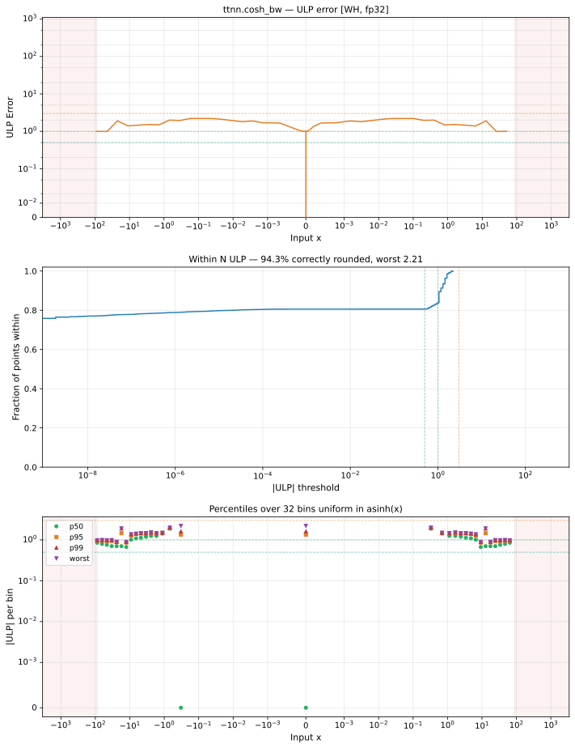

# cosh_bw — Wormhole (WH), float32
_This page is auto-generated by `ttnn-accuracy report`. Do not edit manually._

_Generated: 2026-08-26 07:39_

**Architecture:** Wormhole (WH)  
**Data type:** float32  

---

[← Wormhole (WH) float32 ops](README.md) | [All archs for cosh_bw](../../../by_op/cosh_bw/README.md) | [Top](../../../README.md)

**Measured input range:** all normal values  

| Parameters | Max ULP | Mean ULP | Max abs error |
|------------|---------|----------|---------------|
| `default` | 7.6e+09 ⚠ | 1.03e+08 | 2.29e+35 |

> **Note:** ULP is not a useful metric near x ≈ 0 because the output itself is near zero. In x ∈ [-0.01, 0.01] (15634270 inputs): max absolute error = **0.00173**.

