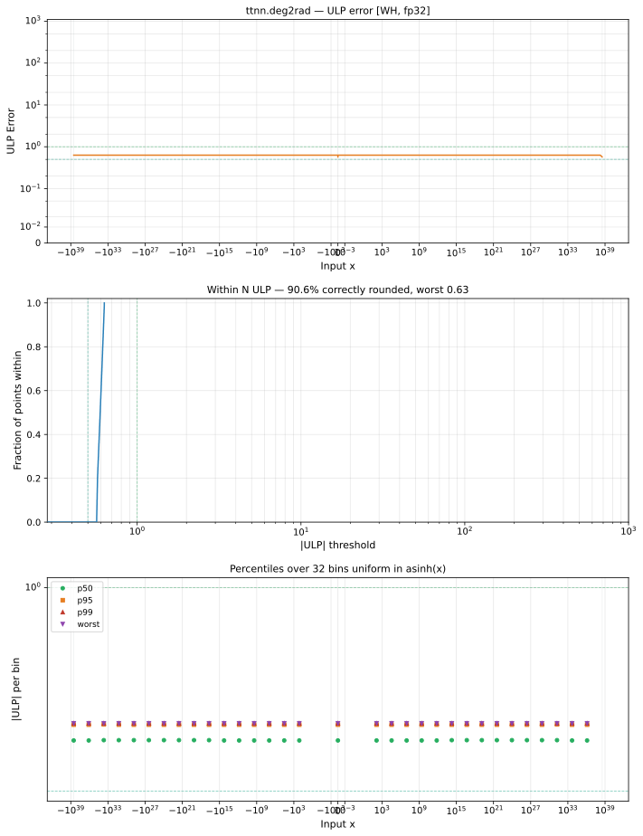

# deg2rad — Wormhole (WH), float32
_This page is auto-generated by `ttnn-accuracy report`. Do not edit manually._

**Architecture:** Wormhole (WH)  
**Data type:** float32  

---

[← Wormhole (WH) float32 ops](README.md) | [All archs for deg2rad](../../../by_op/deg2rad/README.md) | [Top](../../../README.md)

**Measured input range:** x ∈ [-3.403e+38, 3.403e+38]  

|  | `default` |
|---|---|
| Max ULP | 0.63 |
| Min ULP | 0.565 |
| Mean ULP | 0.595 |
| Signed bias (ULP) | 0 |
| p50 ULP | 0.594 |
| p95 ULP | 0.627 |
| p99 ULP | 0.63 |
| Exact fraction | 0 |
| Correctly rounded | 0.906 |
| Accurate to \|x\| | 3.4e+38 |
| Max abs error | 3.63e+29 |
| Max rel error | 6.72e-08 |
| Median rel error | 4.89e-08 |
| Bits of precision (worst) | 23.8 |
| Bits of precision (median) | 24.3 |

**default** — faithful; 63542/65024 tie-breaks  

**Outcomes**

| Parameters | faithful | flushed |
|---|---|---|
| `default` | 63,542 | 1,482 |

**Worst points**

| Parameters | x | golden | device | ULP |
|---|---|---|---|---|
| `default` | 1.3466743e-36 | 2.35039e-38 | 2.3503899e-38 | 0.63 |
| `default` | 2.6933486e-36 | 4.70078e-38 | 4.7007799e-38 | 0.63 |
| `default` | 5.386697e-36 | 9.40156e-38 | 9.4015597e-38 | 0.63 |
| `default` | 1.0773394e-35 | 1.880312e-37 | 1.8803119e-37 | 0.63 |
| `default` | 2.1546788e-35 | 3.760624e-37 | 3.7606239e-37 | 0.63 |
| `default` | 4.3093577e-35 | 7.521248e-37 | 7.5212478e-37 | 0.63 |
| `default` | 8.6187154e-35 | 1.5042496e-36 | 1.50424955e-36 | 0.63 |
| `default` | 1.7237431e-34 | 3.0084993e-36 | 3.0084991e-36 | 0.63 |
| `default` | 3.4474862e-34 | 6.0169986e-36 | 6.0169982e-36 | 0.63 |
| `default` | 6.8949723e-34 | 1.2033997e-35 | 1.20339964e-35 | 0.63 |

**Monotonicity**

_Checked only where the reference is itself ordered, and never across a discontinuity._

| Parameters | Pairs | Violations | Rate | Worst \|Δy\| |
|---|---|---|---|---|
| `default` | 63,540 | 0 | 0 | 0 |

### Special values

| Variant | x | device | golden |  |
|---|---|---|---|---|
| `default` | 0 | 0 | 0 | agree |
| `default` | -0 | 0 | -0 | **differ** |
| `default` | inf | inf | inf | agree |
| `default` | -inf | -inf | -inf | agree |
| `default` | nan | nan | nan | agree |
| `default` | 1.1754944e-38 | 0 | 2.05163e-40 | **differ** |
| `default` | -1.1754944e-38 | 0 | -2.05163e-40 | **differ** |

> **Provenance unknown.** These figures predate run tracking. Re-measure to attribute them.

